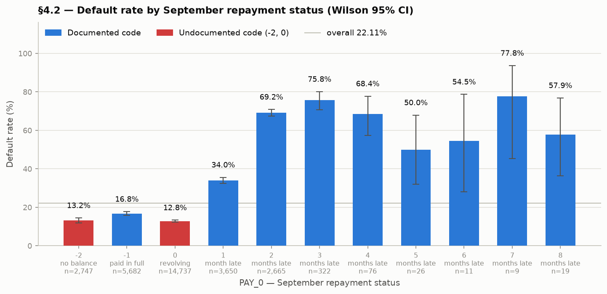
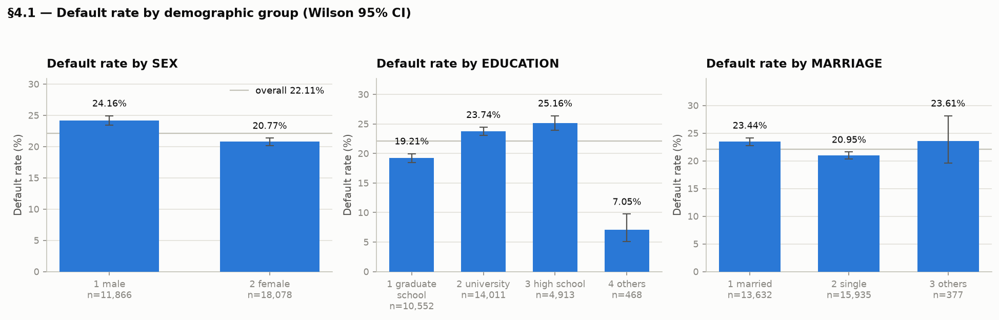

# DataMining-Credit-Card-Defaults

Exploratory data analysis and modelling proposal for the **Default of Credit Card Clients**
dataset (Taiwan, 2005) — [UCI ML Repository id=350](https://archive.ics.uci.edu/dataset/350/default+of+credit+card+clients).

30,000 credit card clients, 23 explanatory variables, and a binary target: whether the client
defaulted on their next monthly payment.

## The research angle

Beyond predicting default, this project asks an interpretability question: **can a model
trained *without* demographic inputs still reconstruct them from financial variables?**

If credit limit, bill amounts and payment history carry enough information to recover sex or
education level, then dropping those columns does not actually remove their influence — it
only hides it. Phase 1 establishes the demographic baseline this question depends on; later
phases test whether the information leak is real and, if so, where in a network it lives.


## Phase 1 findings

The dataset is complete — no missing values anywhere — but semantically messy, and several of
its problems are not mentioned in the official data dictionary.

**The repayment codes are only half documented.** `PAY_n` is defined as `-1 = paid duly` and
`1..9 = months delayed`, but the data also contains `-2` and `0` — and `0` is the *modal value
in every month*, covering roughly half of all client-months. These are read here as
`-2` = dormant, `-1` = paid in full, `0` = revolving credit.

**The response to repayment status is non-monotonic.** Default rises by 56 percentage points
between "revolving" (12.8%) and "two months late" (69.2%). But among the non-delinquent codes
the ordering is counterintuitive: clients who paid *in full* default more often (16.8%) than
those revolving a balance (12.8%). The ordering is also unstable across months, so it is
reported as an anomaly rather than a law — and it means `PAY_n` must not be treated as a
continuous ordinal variable in a linear model.



**21 duplicate groups carry contradictory labels** — identical values across all 23 features
but different outcomes. No classifier can separate these, so they establish a small
irreducible error floor.

**Repayment code `1` is nearly absent before September** — 0, 0, 2, 4, 28 occurrences in
April–August, then 3,688 in September. A behavioural variable does not jump two orders of
magnitude in its final month, which suggests `PAY_0` may be constructed differently from the
five historical columns. Since it is also the most predictive variable in the dataset, this is
recorded as a limitation.

**Default rates differ measurably across demographic groups**, which is the baseline the
later interpretability work builds on.



**Modelling implications carried forward:**

| Finding | Consequence |
|---|---|
| 22.1% default prevalence | Accuracy is unusable — a majority-class classifier scores 77.9%; evaluate with precision–recall |
| Skewness up to 30.4 on payment columns | Scaling required; robust (median/IQR) scaler |
| Non-monotonic `PAY_n` response | Encode categorically, or use a non-linear learner |
| Predictive strength rises with recency | The six `PAY_n` columns are not exchangeable |
| Contradictory duplicate records | A non-zero Bayes error floor exists |

## Repository layout

```
data_mining_assignment.ipynb   Full analysis, 49 cells, executes top-to-bottom
figures/                       16 figures at 150 dpi
requirements.txt               Pinned dependencies (Python 3.14)
SETUP.md                       Environment setup and reproduction guide
```

The dataset is **not** stored here — `ucimlrepo` downloads it at runtime, so the first run
needs an internet connection. The virtualenv is not committed either; `requirements.txt`
reproduces it.

Most of the decisions made so far include inline commentary in the notebook's markdown cells, with what has motivated the decision.

## Quick start

```bash
git clone https://github.com/busta432/DataMining-Credit-Card-Defaults.git
cd DataMining-Credit-Card-Defaults

python3 -m venv .venv
./.venv/bin/pip install -r requirements.txt
```

Then open the notebook and select the `.venv` interpreter as the kernel, or execute it
headlessly:

```bash
./.venv/bin/jupyter nbconvert --to notebook --execute --inplace \
  --ExecutePreprocessor.kernel_name=python3 data_mining_assignment.ipynb
```

Full details, including how to verify a clean run, are in [SETUP.md](SETUP.md).

## Method

Analysis follows the **CRISP-DM** process model, profiling the raw data *before* any cleaning
so that each cleaning rule is argued from evidence gathered beforehand — and so that anomalies
are not erased before they can be found. 

The notebook carries 11 inline assertions covering
row counts, class balance and post-cleaning category domains, so any silent change in the data
or the cleaning logic fails loudly.

## References List

- Yeh, I.-C. and Lien, C.-H. (2009) 'The comparisons of data mining techniques for the
  predictive accuracy of probability of default of credit card clients', *Expert Systems with
  Applications*, 36(2), pp. 2473–2480. — source paper for this dataset
- Chapman, P. *et al.* (2000) *CRISP-DM 1.0: Step-by-step data mining guide*. SPSS Inc.
- Barocas, S. and Selbst, A.D. (2016) 'Big data's disparate impact', *California Law Review*,
  104(3), pp. 671–732.
- He, H. and Garcia, E.A. (2009) 'Learning from imbalanced data', *IEEE TKDE*, 21(9),
  pp. 1263–1284.
- Saito, T. and Rehmsmeier, M. (2015) 'The precision-recall plot is more informative than the
  ROC plot when evaluating binary classifiers on imbalanced datasets', *PLoS ONE*, 10(3),
  e0118432.
- Tukey, J.W. (1977) *Exploratory data analysis*. Reading, MA: Addison-Wesley.
