# Predicting Credit Card Default with XGBoost: Gradient Boosting and the Price of Interpretability

**3031ICT Data Mining — Phase 2 Individual Implementation**
Daniel Busing · Group 24 · Algorithm: XGBoost

---
## 1. Introduction

Phase 1 profiled the UCI *Default of Credit Card Clients* dataset (Yeh & Lien, 2009): 30,000
Taiwanese clients, 23 explanatory variables, and a binary next-payment default target. After
de-duplication: **29,944 rows, 6,622 defaults, 22.11% prevalence**. The proposal set two research
questions, and this report is organised to answer them:

> **Q1.** *Does the marginal performance gain achieved by ensemble architectures and non-linear
> models justify the corresponding loss in direct rule-based interpretability?*
>
> **Q2.** *Can post-hoc explainability techniques bridge this gap by providing
> regulatory-compliant decision auditability for non-linear ensemble models?*

Phase 2 is an individual deliverable, so this implements **XGBoost only**; teammates submit a
Decision Tree (Izak Murray) and a Logistic Regression (Declan Boundy) separately. The logistic
regression and single tree shown here are **untuned internal references, built only to locate
XGBoost on a capability axis** — not my teammates' tuned submissions.

Neither question yields to a single accuracy number. Q1 needs a *ladder* — constant prediction up
to tuned gradient boosting, each rung buying capability at a readability cost that is measured
rather than asserted. Q2 asks the converse: given an unreadable top rung, can SHAP reconstruct an
audit trail, and is that reconstruction *stable enough to be one*? An explanation that reorders
under reseeding is not a compliance artefact.

Fourteen experiments were run and committed to `results/*.json`. Because the page cap constrains
what is *printed*, not what was *run*, §2–§4 carry the design reasoning and §5 states numbers
tersely; full tables, nine further figures, extended discussion and the source listing are in the
uncapped appendix. Three Phase 1 commitments are discharged: the fairness check (§4.6, §5.6), the
aggregated-vs-individual `PAY_n` benchmark (§4.2, §5.2), and the consequences of rejecting PCA
(§3.5).

---
## 2. Solution — Part I: Investigating the `xgboost` library

XGBoost (Chen & Guestrin, 2016) is the algorithm allocated to this submission, and two Phase 1
findings make it well matched to the data. `PAY_n` has a **non-monotonic** response (16.8% default
when paid in full, 12.8% when revolving a balance, 69.2% at two months late), and the monetary
columns are **severely collinear** (`BILL_AMT1–6` VIF 13.9–25.7). An axis-aligned learner recovers
the first through *stacked* splits and is indifferent to the second, since a tree has no coefficients
for collinearity to destabilise.

The theoretical overview above derived the mathematics. This part investigates the *tool*: which
Python library implements that mathematics, what its core functions are, and how this project
constrains them so the derivation's guarantees survive contact with code.

### 2.1 The tool: `xgboost`, and the alternatives it was selected over

Four libraries on PyPI implement gradient-boosted decision trees to production standard. All four
were considered against the requirements of *this* problem:

| Library (PyPI) | Origin | Distinguishing mechanism | Verdict for this problem |
|---|---|---|---|
| **`xgboost`** | Chen & Guestrin (2016) | Level-wise growth, sparsity-aware splits, explicit L1 **and** L2 objective | **Selected** |
| `lightgbm` | Ke et al. (2017), Microsoft | Leaf-wise growth, GOSS row sampling, exclusive feature bundling | Its speed advantages are asymptotic; at 29,944 × 23 they do not materialise, and leaf-wise growth overfits more readily at this size |
| `catboost` | Prokhorenkova et al. (2018), Yandex | Ordered boosting, ordered target statistics for categoricals | Its headline advantage is high-cardinality categoricals; here the widest is `EDUCATION` at four levels |
| `scikit-learn` (`HistGradientBoostingClassifier`) | Pedregosa et al. (2011) | Histogram binning, LightGBM-inspired | Exposes `l2_regularization` only — no $\gamma$ or L1 control, so most of §4.1's search space is unreachable |

Three reasons decided it, in descending weight. **Q2 is an explainability question**, and interventional
TreeSHAP against a background sample (§4.5) is the hardest single requirement in the project;
`xgboost` is the most heavily exercised backend in `shap`'s `TreeExplainer`, so it is the lowest-risk
path to a working explanation. **Its objective is the most explicitly regularised of the four**,
exposing $\gamma$, $\lambda$ and $\alpha$ as independent controls — which matters because §4.1 finds
this dataset noise-limited rather than capacity-limited, so regularisation is the axis that does the
work. And **it is the reference implementation**: the other three position themselves against the
2016 KDD paper, so results obtained with it are the most comparable to the published literature.

Versions are pinned in `requirements.txt` — `xgboost==3.4.1`, `shap==0.52.0`, `optuna==5.0.0` on
Python 3.14 — and every number in this report was produced by that build.

### 2.2 Core functions of the library

The project touches nine entry points. The scikit-learn-compatible `XGBClassifier` wrapper covers
the first six; the rest require dropping to the native `Booster` underneath it.

| Call | Used in | Purpose |
|---|---|---|
| `XGBClassifier(**params)` | `models.py` | Construct. Carries *all* hyperparameters, `early_stopping_rounds` included |
| `.fit(X, y, eval_set=, verbose=)` | `runner.py` | Train. `eval_set` is the slice early stopping monitors |
| `.predict_proba(X)[:, 1]` | `runner.py`, `tuning.py` | Default probability — input to every metric and threshold |
| `.predict(X, output_margin=True)` | `exp11_shap.py` | Raw log-odds, for the SHAP additivity check |
| `.best_iteration` | `runner.py`, `exp02` | The round count early stopping actually chose |
| `.get_booster()` | `models.py`, `exp12` | Escape hatch to the native API |
| `Booster.get_score(importance_type=)` | `exp12_stability.py` | `gain`/`cover`/`weight`/`total_gain` importances (§5.5) |
| `Booster.get_dump()` | `models.py` | Per-tree text; its length is the tree count |
| `Booster.save_model()` | `exp02_tuning.py` | Persist the tuned model as JSON |

Condensed, the canonical path every one of the fourteen experiments follows:

```python
from xgboost import XGBClassifier

est = XGBClassifier(tree_method="hist", eval_metric="auc", max_depth=6, eta=0.0125,
                    n_estimators=2000, early_stopping_rounds=50)   # constructor, not .fit()
est.fit(X_fit, y_fit, eval_set=[(X_es, y_es)], verbose=False)      # ES chooses the round count
proba = est.predict_proba(X_val)[:, 1]                             # never .predict()
n_trees = est.best_iteration + 1                                   # 449, not the 2000 ceiling
```

`xgboost.train()` and a hand-built `DMatrix` are **never** called. The wrapper is preferred because
it makes the model a drop-in for scikit-learn's CV splitters and for `imblearn.Pipeline` (§4.3), and
because `hist` internally materialises a `QuantileDMatrix` regardless, which builds the bin sketch
directly and avoids the dense intermediate copy a plain `DMatrix` would allocate.

### 2.3 Our implementation: one factory, and the arguments it exposes

The code above is how one *uses* the library; the code below is how this project *constrains* it.
Every estimator in all fourteen experiments comes from a single factory, so no two arms can drift
apart on a setting nobody remembered to match:

```python
def xgb_classifier(params=None, spw=1.0, early_stopping=True,
                   enable_categorical=False, seed=SEED):
    p = dict(XGB_FIXED)                       # tree_method="hist", eval_metric, n_jobs
    p["enable_categorical"] = enable_categorical
    p["random_state"], p["scale_pos_weight"] = seed, spw
    if early_stopping:                        # constructor, NOT .fit(), since 2.0
        p["n_estimators"] = N_ESTIMATORS_CAP  # 2000, a ceiling -- ES picks the real count
        p["early_stopping_rounds"] = ES_ROUNDS
    return XGBClassifier(**{**p, **(params or {})})
```

Every term of the regularised objective reaches that constructor under its *native booster* name, and
the library's penalty is a **superset** of the derivation's — it adds an L1 term, so in implementation
$\Omega(f) = \gamma T + \tfrac{1}{2}\lambda \|w\|^2 + \alpha\|w\|_1$. The eight arguments searched in
§4.1, and where in the algorithm each one acts:

| Symbol | Argument | Acts | Searched range → selected |
|---|---|---|---|
| $\lambda$ | `reg_lambda` | denominator of the gain | 0.01–100 (log) → **34.3** |
| $\alpha$ | `reg_alpha` | L1 on leaf weights | 0.001–10 (log) → **0.0015** |
| $\gamma$ | `gamma` | flat toll per split | 0.0–5.0 → **0.695** |
| — | `min_child_weight` | floors $\sum h_i$ per leaf | 1.0–20.0 (log) → **4.19** |
| — | `max_depth` | caps structure before gain | 3–8 → **6** |
| $\eta$ | `eta` | shrinks the fitted tree | 0.01–0.30 (log) → **0.0125** |
| — | `subsample` | rows drawn before split search | 0.60–1.00 → **0.604** |
| — | `colsample_bytree` | columns drawn before split search | 0.50–1.00 → **0.800** |

Two are library behaviour the mathematics alone does not predict. **`min_child_weight` floors
$\sum h_i$, not the row count** — and for log-loss $h_i = p_i(1-p_i)$, so it is a floor on *prediction
uncertainty*, not population: a leaf of confidently-classified rows is cheap, the same count of
uncertain ones is not. At 22.11% prevalence that is the guard against leaves which look pure only for
being small. And **`reg_lambda` sits in the denominator**, discounting splits in proportion to how
little Hessian mass supports them — softer and better-targeted than `max_depth`, which is why §4.1
finds the tuner leaning on $\lambda$ = 34.3 while ranking `max_depth` *last* by fANOVA importance.

One API trap: `eta`/`learning_rate`, `reg_lambda`/`lambda` and `reg_alpha`/`alpha` are alias pairs,
and passing both members silently keeps one. The project writes the native names only, and
`SEARCH_SPACE` in `config.py` is the single declarative source — `tuning.py` suggests from it and this
table is printed from it, so the documented search cannot drift from the one that ran.

### 2.4 Two implementation decisions the data forced

**`tree_method="hist"` is lossless here, not merely cheap.** `hist` bins each feature into at most 256
buckets once, then accumulates $(G, H)$ per bin at $O(n)$ per node instead of exact greedy's
$O(n \log n)$ sort. Normally that is a real trade — but the six `PAY_n` columns take eleven distinct
integer values ($-2$ to $8$) and `SEX`, `EDUCATION` and `MARRIAGE` take two to four, so every
candidate split on the columns carrying the signal is **exactly representable** and no split the exact
method would find is lost. Only the continuous monetary columns bin approximately, and §4.2 shows them
to be the least load-bearing block. This is what made the grid affordable: ~2.3 s per trial, so the
planned 60–80-trial search became 150 trials in 1,166 s (§4.1).

**Sparsity-aware splits set the `NaN` contract.** At each split XGBoost enumerates candidates twice,
sending `NaN` left then right, and keeps the higher gain — so missing routing is *fitted*, not imputed.
The feature engineering was designed around this. Phase 1 found 1,930 rows with a negative `BILL_AMT`
(a credit balance), where `PAY_AMT / BILL_AMT` is undefined; filling zero would assert *no repayment*,
a claim about the client the data does not support.

```python
safe_bills = np.where(bills > 0, bills, np.nan)   # NaN *before* the division,
ratios = pays / safe_bills                        # so no +/-inf can be emitted
```

Substituting `np.nan` **before** dividing rather than cleaning up after is load-bearing: it yields
`NaN` rather than $\pm\infty$, and an infinity would survive into the bin sketch above and corrupt
every split boundary on that column. `engineer()` closes the contract with
`assert not np.isinf(out[added].to_numpy(dtype=float)).any()`, so the failure mode is a stopped run
rather than a quietly wrong model.

### 2.5 Round count, and three behaviours that fail silently

**`n_estimators` is deliberately not searched.** The optimal round count is a function of `eta`, so
tuning both searches one quantity twice. It is capped at 2,000 and *decided* by early stopping
against an inner 15% slice of each training fold (§3.2). At the selected `eta` = 0.0125 the final
model stopped at **449 trees** (mean best iteration 400.4 across the 25 fits) — a number no grid
would have proposed, and the reason §4.1 attributes most of the +0.0226 tuning gain to early stopping
and a low learning rate rather than to a precise optimum. Rung 5 of the ladder calls a separate
`xgb_library_defaults()` with early stopping *off*, so that gain is isolated rather than confounded.

Three version-specific behaviours fail **silently** and are worth naming:

1. **`early_stopping_rounds` and `eval_metric` moved to the constructor** in XGBoost 2.0. Passed to
   `.fit()` they are ignored, leaving the booster optimising the default metric while the code reads
   as though it does not.
2. **`enable_categorical` defaults to `True` in 3.4.** `shap` 0.52 inspects that flag alone — not
   whether any column is `category` dtype — and refuses interventional TreeSHAP with
   `NotImplementedError: Categorical split is not yet supported`. Pinning it `False` in `XGB_FIXED`
   is what keeps §4.5's explanations computable; only the §4.2 encoding arm sets it `True`, via
   `categorical_frame()`.
3. **`scale_pos_weight` is neg/pos**, not pos/neg. `models.scale_pos_weight(y)` derives it from the
   labels rather than a literal, and `clean()` pins the polarity upstream by asserting the positive
   count (`df[TARGET].sum() == 6622`, the minority class), because an inverted ratio is a bug that
   still trains and still scores plausibly.

Two further API choices support later sections. **`predict()` is never used for a classification
decision** — it hardcodes a 0.5 cut, which would silently contradict the frozen threshold of §3.3, so
every decision goes through `predict_proba(X)[:, 1] >= tau`. The single call to it in the codebase
passes `output_margin=True` to retrieve raw log-odds for the §4.5 SHAP additivity check, where no
threshold is involved. And interpretability cost for the ladder is
read straight out of the fitted booster with `len(est.get_booster().get_dump())`, so the
"not directly available" column of §5.1 is a *measured* node count rather than an assertion.

---
## 3. Solution — Part II: Experimental design and the leakage argument

### 3.1 De-duplication, hold-out and cross-validation

Phase 1 found 108 rows in 52 duplicate groups, 21 with **contradictory labels** (same features,
different outcomes), so de-duplication precedes the split: otherwise identical rows straddle the
boundary and the model is scored on memorised rows. The hold-out is 80/20 stratified on `DEFAULT` at `random_state=42` → 23,955 train / 5,989 test; 1,324 test positives give
an AUC standard error ≈0.007.

Tuning uses `StratifiedKFold(5, shuffle=True, random_state=42)` on the training portion only;
variance comes from `RepeatedStratifiedKFold(5 × 5, random_state=7)` refitting only the *selected*
configuration → 25 fits, mean ± SD. The seeds differ deliberately: reusing `42` would correlate the
variance folds with the tuner's and understate the SD.

### 3.2 Early stopping, and the single leakage boundary

Early stopping needs a validation signal; both obvious sources leak: the test set outright, the
CV fold subtly, since the fold that *scores* a configuration must not also decide when to stop
fitting it. A stratified **15% slice is carved from each training fold**:

```python
def fit_one(est, X_tr, y_tr, seed=SEED):
    # eval_set comes from an inner slice of *this fold's training rows*, so the outer
    # validation fold is never seen by early stopping and the test set never at all.
    if _uses_early_stopping(est):
        i_fit, i_es = train_test_split(np.arange(len(y_tr)), test_size=ES_SLICE,
                                       stratify=y_tr, random_state=seed)
        est.fit(X_tr.iloc[i_fit], y_tr[i_fit], verbose=False,
                eval_set=[(X_tr.iloc[i_es], y_tr[i_es])])
    else:
        est.fit(X_tr, y_tr)
    return est
```

This is the project's single leakage boundary: all fourteen experiments call
`runner.cv_evaluate()` → `fit_one()`, none its own CV loop. `src/data.py` separates
`training_context()` from `test_context()`, the latter imported only by `exp14_final` and the two
SHAP experiments, which explain without selecting; the audit is one grep (§5.7).

### 3.3 Threshold selection — the critical leakage point

**Out-of-fold** probabilities from `cross_val_predict` on the training portion are used: expected
cost is minimised over a 501-point grid on *those* probabilities, the winner **frozen as a scalar**
(asserted in $(0,1)$), so the test set sees one number it did not help select. Every decision uses
`predict_proba(X)[:, 1] >= tau`, never `model.predict()`, which silently reimposes 0.5.

### 3.4 Why ROC-AUC is the objective, and why `scale_pos_weight` is not searched

ROC-AUC is primary for three reasons: it is the credit-scoring benchmark standard (Lessmann et al.,
2015); it is **prevalence-independent**, hence comparable across §5.1's ladder and §5.6's fairness
subgroups; and it has lower fold-to-fold variance than PR-AUC, resolving smaller differences at a
fixed trial budget. `aucpr` is logged, not optimised; PR curves are
drawn as attainable points, PR-space interpolation being invalid with few distinct scores (Davis &
Goadrich, 2006; Saito & Rehmsmeier, 2015).

Hence `scale_pos_weight` is not searched: ROC-AUC is invariant to monotone score transformations,
and `scale_pos_weight` rescales positive-class gradients, shifting the *score scale* but not the
*ranking*. A tuner optimising ROC-AUC is nearly blind to it and would pick a value at random,
confounded with everything else. So it is **excluded from the search space**, fixed *per arm*, each
arm tuned independently, making the imbalance study controlled rather than confounded.

### 3.5 How Phase 1 findings map to concrete choices

| Phase 1 finding | Design consequence |
|---|---|
| `PAY_n` response non-monotonic, `0` is modal | Non-linear learner; native integer encoding, benchmarked in §4.2 rather than assumed |
| Predictive strength rises with recency (ρ 0.143 → 0.292) | Six `PAY_n` kept distinct, not aggregated; recency ablation in §5.2 |
| `BILL_AMT` VIF 13.9–25.7 | Columns **kept** — collinearity degrades attribution, not tree prediction; caveats SHAP (§4.5) instead |
| PCA rejected (all-14-PC AUC 0.713 < raw) | No dimensionality reduction anywhere in the pipeline |
| Skewness up to 30.4 on monetary columns | **No scaling.** Trees are scale-invariant; §4.2 tests this rather than asserting it |
| 22.11% prevalence | Accuracy reported only to discredit it (§5.1); PR-AUC and expected cost used instead |
| Demographic disparities measured | Fairness check (§4.6) asks whether the model amplifies them |

### 3.6 Statistical honesty

Every metric is mean ± SD over the 25 repeated-CV fits — SD, not standard error, so it describes
fold-to-fold variability — and **no difference under one fold-SD is called an improvement**.
DeLong's test (DeLong et al., 1988) is used only on paired hold-out ROC curves, never across CV
folds, where samples are not independent. Per Nadeau and Bengio (2003) repeated-CV *t*-tests are
anti-conservative, so arm comparisons report paired per-fold effect sizes rather than *p*-values.

---
## 4. Solution — Part III: Tuning, encoding, imbalance, cost and explanation design

### 4.1 Search strategy and what the selected configuration reveals

Optuna's **TPE sampler** (`multivariate=True`) with a `MedianPruner` was preferred to grid or random
search: eight dimensions at three values each is $3^8 = 6{,}561$ configurations, and random search
needs ~3× TPE's trials. *Deviation from plan:* at ~2.3 s per trial, not 15–30 s, **150 trials** ran,
not 60–80 (142 completed, 8 pruned, 1,166 s; Figure A1).

The eight dimensions, their ranges and the selected values are tabulated in §2.3; what matters here
is *where in those ranges the tuner landed*. `eta` and `subsample` sit at the *bottom* of theirs,
`reg_lambda` high in a log range to 100 —
read via the Gain formula, a **slow-learning, heavily regularised** fit, the signature of **modest
signal relative to noise**. **fANOVA** (Figure A1b) agrees: `subsample` first at 0.31 of objective
variance, **`max_depth` last at 0.04**: **noise-limited, not capacity-limited**. The plan predicted
`min_child_weight` would dominate on the Hessian-floor argument; it placed third (C.1).

The *entire* search spans 0.776–0.785 ROC-AUC, **under the 0.0107 pooled fold-SD**, so the choice is
indistinguishable from fold noise. §5.1's +0.0226 tuning gain stands because library defaults sit
*outside* that space (100 fixed rounds at `eta` = 0.3, no early stopping): **most of the gain comes
from early stopping and a low `eta`, not a precise optimum.**

### 4.2 Encoding and scaling: tested, not assumed

One-hot is the conventional answer to `PAY_n`'s non-monotonicity; it was tested against native
integers, `enable_categorical=True` and a signed-log transform (Table B2), the arms indistinguishable
(§5.2). **Native integers are carried forward** on three grounds: *stacked* axis-aligned splits
already recover non-monotonicity, so one-hot buys only depth; integers keep the six `PAY_n` distinct
where one-hot's 66 dummies fragment them, protecting the recency gradient (ρ 0.143 → 0.292); and 23
features rather than 79 keeps SHAP readable for Q2.

Monotone rescaling cannot move rows across an axis-aligned split, so Phase 1's robust-scaler advice
(skewness up to 30.4) applies only to distance- and gradient-based learners. Likewise `BILL_AMT1–6`
are **kept** despite VIF 13.9–25.7: collinearity inflates coefficient variance and trees have none;
it damages *attribution*, a §4.5 caveat, not a reason to discard signal.

### 4.3 Imbalance: why reweighting and SMOTE are design errors here

At 22.11% prevalence the data is mildly imbalanced — enough to break accuracy, not learning. Four
arms ran under §3.4's protocol: baseline at τ = 0.5; the same fit with τ moved; `scale_pos_weight` =
3.52 (neg/pos) at τ = 0.5 and τ re-tuned; and SMOTE in an `imblearn.Pipeline`, oversampled per-fold
on training rows only.

**Reweighting is indirect threshold-moving that damages the probabilities on the way through**
(§5.3): inflating the positive-class gradient raises every predicted probability without changing the
base rate, so the boundary shifts but the probability semantics §4.4 consumes are destroyed. **SMOTE
is rejected on dataset-specific grounds**: averaging `PAY_0` = 0 with `PAY_0` = 1 yields
`PAY_0` = 0.37, a code that does not exist, exactly where Phase 1
measured non-monotonicity. `max_delta_step` is dismissed too, for imbalance beyond ~100:1 where the
logistic Hessian underflows.

### 4.4 The cost matrix, and why the sweep doubles as a calibration test

The cost ratio is anchored: a false negative costs LGD × EAD, the unrecovered balance, at
retail-unsecured LGD ≈ **0.70**; a false positive forgoes net interest margin, NIM ≈ **0.12**. So
r = 0.70/0.12 = **5.83**, reported as **6:1**, and swept over {1, 2, 5, 6, 10, 20}.

Elkan's (2001) optimum is $p^* = 1/(1+r)$ — 0.143 at r = 6. Comparing it against the empirically
cost-minimising out-of-fold threshold is a **calibration test**: Elkan *assumes true posterior
probabilities* and says nothing about a model that merely ranks, so agreement is independent evidence
of calibration without a Brier score, confirmed if isotonic recalibration *tightens* it (§5.4). A
`LIMIT_BAL`-weighted scheme is also reported as an EAD proxy; the flat one is frozen for the
hold-out because it is what the cost matrix defines. The proposal's 9.8-million-customer and
NT$1.17bn figures are **motivation for caring about cost asymmetry**, never a result of this model.

### 4.5 TreeSHAP configuration, and what Q2 actually requires

Q2's *regulatory-compliant decision auditability* is three questions, each driving a configuration
choice: **exact**, **reproducible**, **true of the data** not of the model.

*Exactness* requires **log-odds (margin) space**, where the decomposition is additive and exact;
probability space is not, so appears only in the single-client waterfall.
`feature_perturbation="interventional"` on a 1,000-row stratified background is preferred to
`tree_path_dependent`, which weights by training split frequencies (Lundberg et al., 2020).

*Reproducibility* is what an audit trail needs: exp12 compares five reseeded refits by Spearman ρ
between mean|SHAP| vectors and top-10 Jaccard. It ranks features by five measures, preferring SHAP
and permutation importance, which use unseen rows, unlike `gain`/`cover` (training-loss) or `weight`
(split counts).

*Truth of the data* is tested on the **held-out** set (2,000-row stratified sample): does mean SHAP
per `PAY_0` code reproduce the Phase 1 non-monotonicity the model was never shown? Two caveats:
`BILL_AMT1–6` collinearity (§4.2) makes SHAP split credit arbitrarily among interchangeable columns,
defensible only as a *group total*; and SHAP attributes the **model's output, not a causal
mechanism**.

### 4.6 Fairness measurement design

Fairness asks not whether disparities appear — they are in the data — but whether the model
**amplifies, preserves or attenuates** them, comparing observed default-rate gaps against
*selection*-rate gaps at the deployed threshold. Metrics use out-of-fold training predictions at the
frozen τ, where nothing is selected and subgroups are ~4× larger, tightening Phase 1's Wilson
intervals. The **four-fifths rule** — a selection-rate ratio below 0.80 — is the conventional
adverse-impact screen, and is the test §5.6 applies. Since §5.2 shows the demographic columns nearly free to discard, the no-demographics arm
is re-audited on the same subgroups: if financial columns proxy for them, deleting the protected
columns removes the *audit trail*, not the influence — strictly worse (Barocas & Selbst, 2016).

---
## 5. Key results and metrics

All numbers are read programmatically from `results/*.json`; CV figures are mean ± SD over 25 fits
(§3.6). **The three metrics committed to in Task 1 are each reported against the chosen dataset:**
**ROC-AUC** and **PR-AUC** per algorithm in Table 1 and on the hold-out in Table 7, with curves in
Figure 4; the **confusion matrix** as the raw counts of false negatives against false positives in
Table 8; and the **cost-sensitive evaluation** that multiplies those counts by asymmetric financial
weights in Tables 3–4 and Figure 2.

### 5.1 The complexity ladder — answering Q1

**Table 1.** Eight rungs. "Read" is the parameters, rules or nodes behind one decision.

| Rung | Model | Feat. | ROC-AUC | PR-AUC | Brier | Acc @0.5 | Recall @0.5 | Read |
|---|---|---|---|---|---|---|---|---|
| 0 | Majority class | 23 | 0.5000 ± 0.0000 | 0.2212 | 0.2212 | 0.7788 | 0.0000 | 1 |
| 1 | `PAY_0`, depth-1 tree | 1 | 0.6441 ± 0.0075 | 0.3774 | 0.1460 | 0.8197 | 0.3292 | 1 |
| 1b | `PAY_0` as a raw score | 1 | 0.6910 ± 0.0083 | 0.4394 | — | — | — | 1 |
| 2 | Logistic regression | 23 | 0.7248 ± 0.0086 | 0.5034 | 0.1448 | 0.8094 | 0.2374 | 24 |
| 3 | Decision tree (depth-tuned) | 23 | 0.7542 ± 0.0103 | 0.5062 | 0.1383 | 0.8195 | 0.3522 | 109 |
| 4 | Random forest | 23 | 0.7641 ± 0.0096 | 0.5374 | 0.1384 | 0.8183 | 0.3769 | 692,674 |
| 5 | XGBoost, defaults | 23 | 0.7619 ± 0.0080 | 0.5293 | 0.1415 | 0.8185 | 0.3701 | 100 |
| 6 | **XGBoost, tuned** | 23 | **0.7845 ± 0.0071** | **0.5602** | **0.1348** | 0.8195 | 0.3381 | 499 |

**Accuracy cannot separate a one-line rule from a tuned ensemble here:** it spans 0.8094–0.8197
while ROC-AUC spans 0.6441–0.7845 (C.4). Rung 1b, the unfitted raw code, beats a depth-1 tree
on it by **+0.0469**. **Untuned XGBoost does not beat the random forest**, so its advantage is a
*tuning* one, yet the forest needs **692,674 nodes** against **499**. **Tuning is the largest single
gain, +0.0226 against a pooled fold-SD of 0.0107** (≈2.1 SD, B9).

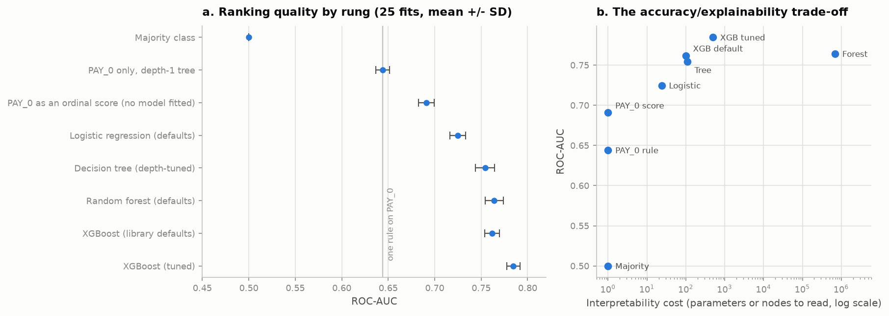

**Figure 1.** ROC-AUC per rung, and the same scores against interpretability cost (log axis).

**Answer to Q1.** One readable rule → tuned XGBoost buys **+0.1404 ROC-AUC** at a reading cost
rising from 1 to 499, with PR-AUC rising 0.3774 → 0.5602, a **48% relative improvement**. The gain
**is** justified, but conditionally, and the condition is Q2: adverse-action notices need a reason
per decision. The first step is the most valuable: `PAY_0` alone delivers 0.6910 of 0.7845.

### 5.2 Feature studies

Tables B2–B6; figures A3–A4. As Phase 1 predicted, replacing the raw columns with the 17 engineered
ones costs **−0.0059**, and adding them alongside gains only +0.0035. **Where the signal lives:**
dropping the six `PAY_n` costs **−0.0471**, the largest effect in the project, while those six alone
reach 0.7492 — **95.5% of the full ROC-AUC from 26% of the features**. **k = 3 months of history is
the smallest window inside one fold-SD of the full six.**

### 5.3 Class imbalance

**Table 2.** Imbalance arms, 25 fits, τ frozen at r = 6; arms A and B are one model, two
thresholds.

| Arm | Strategy | `spw` | τ | ROC-AUC | PR-AUC | Brier | Recall | Prec. | OOF cost (r=6) |
|---|---|---|---|---|---|---|---|---|---|
| A | baseline, default threshold | 1.00 | 0.500 | 0.7845 ± 0.0071 | 0.5602 | **0.1348** | 0.357 | 0.678 | 21,331 |
| B | **A's model, threshold moved** | 1.00 | 0.134 | 0.7845 ± 0.0071 | 0.5602 | **0.1348** | 0.829 | 0.333 | 14,239 |
| C | reweighted, default threshold | 3.52 | 0.500 | 0.7848 ± 0.0074 | 0.5581 | 0.1801 | 0.634 | 0.469 | 15,431 |
| C′ | reweighted, threshold moved | 3.52 | 0.358 | 0.7848 ± 0.0074 | 0.5581 | 0.1801 | 0.819 | 0.339 | **14,215** |
| D | SMOTE inside the fold | 1.00 | 0.472 | 0.7681 ± 0.0088 | 0.5218 | 0.2200 | 0.811 | 0.324 | 14,952 |

Reweighting moves ROC-AUC **+0.0003 against a fold-SD of 0.0071** while Brier degrades **34%**, and
arm C at τ = 0.5 lands between A's recall and B's — the §4.3 mechanism made visible, because
reweighting *is* threshold-moving. Re-tuning C's threshold leaves C′ and B **0.17%** apart in cost:
**both routes reach the same operating point; only one keeps the probabilities.** SMOTE alone loses
real ranking quality (**−2.3 fold-SD**), so **arm B is carried forward**.

### 5.4 Calibration and cost-sensitive thresholds

**Table 3.** The cost matrix. A missed default costs loss-given-default × exposure; a false alarm
costs the forgone net interest margin on a client who would have repaid. With LGD = 0.70 and
NIM = 0.12 the ratio is 0.70/0.12 = 5.83, carried as **r = 6**.

| | Predicted **repay** | Predicted **default** |
|---|---|---|
| Actual **repay** | TN — cost 0 | FP — cost **1** (forgone margin) |
| Actual **default** | FN — cost **6** (unrecovered balance) | TP — cost 0 |

Total expected cost is therefore **6 × FN + 1 × FP**, applied to the raw counts of Table 8. The
asymmetry is the entire reason a 0.5 threshold is wrong here: it prices both errors equally when
one costs six times the other.

**Table 4.** Cost sweep on out-of-fold predictions; *p*\* is Elkan's optimum 1/(1+r). Reliability
curves: A5.

| r | Elkan *p*\* | Empirical τ | τ − *p*\* | Min cost | Cost at τ = 0.5 | Saving | Recall | Prec. |
|---|---|---|---|---|---|---|---|---|
| 1 | 0.5000 | 0.5360 | +0.0360 | 4,286 | 4,306 | 20 | 0.335 | 0.699 |
| 2 | 0.3333 | 0.3180 | −0.0153 | 7,189 | 7,711 | 522 | 0.529 | 0.561 |
| 5 | 0.1667 | 0.1781 | +0.0114 | 12,978 | 17,926 | 4,948 | 0.719 | 0.408 |
| **6** | **0.1429** | **0.1341** | **−0.0088** | **14,239** | **21,331** | **7,092** | **0.829** | **0.333** |
| 10 | 0.0909 | 0.0841 | −0.0068 | 16,575 | 34,951 | 18,376 | 0.947 | 0.267 |
| 20 | 0.0476 | 0.0541 | +0.0065 | 18,058 | 69,001 | 50,943 | 0.990 | 0.236 |

Arm A is already close to calibrated — mean predicted **0.2189** against a 0.2212 base rate, ECE
0.0212, not the default expectation for boosted trees (Niculescu-Mizil & Caruana, 2005) — while arm
C is not, at mean **0.4299** and **ECE 0.2088**. **The empirical optimum tracks the analytic
curve:** mean absolute deviation between τ and 1/(1+r) is **0.0141** raw and **0.0079** after
isotonic calibration, so calibrating *tightens* the agreement (§4.4). **The threshold is where the
money is:** at r = 6 the frozen τ cuts expected loss **33.2%** against the default 0.5 (C.3).

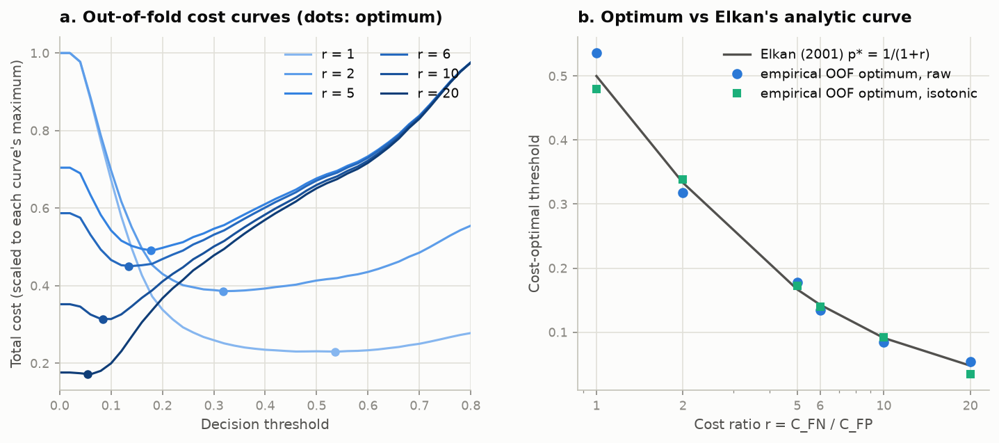

**Figure 2.** Out-of-fold total cost against decision threshold, one curve per cost ratio and each
scaled to its own maximum, with the cost-minimising point marked; and those optima against Elkan's
analytic 1/(1+r). Each curve is flat near its minimum, so the saving survives getting τ slightly
wrong — but all of them climb steeply toward 0.5, which is why the default threshold is expensive.

### 5.5 SHAP — answering Q2

SHAP reconstructs the margin to a maximum error of **3.7 × 10⁻⁶** — float32 noise, not
method error — and `tree_path_dependent` barely reorders it (ρ = 0.973, §4.5).

**Table 5.** Top ten features by mean|SHAP|, with cross-measure ranks and five-seed stability.

| # | Feature | mean\|SHAP\| | Share | Rank by `gain` | Rank by permutation | Rank SD, 5 seeds |
|---|---|---|---|---|---|---|
| 1 | `PAY_0` | 0.3780 | 22.3% | 1 | 1 | 0.00 |
| 2 | `LIMIT_BAL` | 0.2078 | 12.3% | 8 | 2 | 0.00 |
| 3 | `BILL_AMT1` | 0.1254 | 7.4% | 10 | 3 | 0.45 |
| 4 | `PAY_AMT2` | 0.1087 | 6.4% | 7 | **22** | 0.55 |
| 5 | `PAY_AMT1` | 0.0966 | 5.7% | 9 | 16 | 1.41 |
| 6 | `PAY_2` | 0.0907 | 5.3% | 2 | 11 | 1.10 |
| 7 | `PAY_3` | 0.0837 | 4.9% | 3 | 9 | 1.00 |
| 8 | `PAY_AMT3` | 0.0816 | 4.8% | 11 | 8 | 0.55 |
| 9 | `PAY_4` | 0.0609 | 3.6% | 4 | 5 | 0.55 |
| 10 | `PAY_AMT6` | 0.0524 | 3.1% | 15 | **23** | 2.77 |

The six repayment-status columns take **40.2%** of total attribution against **16.5%** for the six
`BILL_AMT`, §5.2's ablation reached by attribution. **Convergent validation:** mean SHAP per `PAY_0`
code runs −0.214, −0.165, **−0.288**, +0.250, +1.517 and +1.365 for codes −2 to 3, so code 0 is the
*most negative* of any code, inverting the intuitive ordering, and the rank correlation with
observed default rate is **ρ = 0.886**.

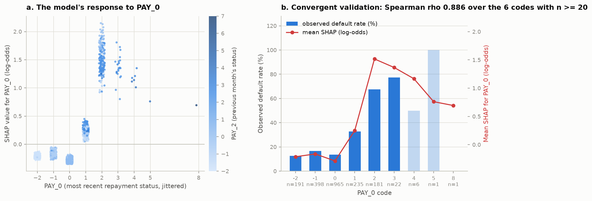

**Figure 3.** SHAP for `PAY_0` by value, coloured by `PAY_2`; and mean SHAP per code against
observed default rate.

**Reproducibility.** Over five reseeded refits, Spearman ρ between mean|SHAP| vectors
averages **0.9375** and top-10 Jaccard **0.8727**, with `PAY_0` and `LIMIT_BAL` never moving and
instability concentrated where §5.2 predicted: mean rank SD **1.73 across `BILL_AMT1–6` against
1.16 elsewhere**.

**Answer to Q2: yes, with a stated scope.** The explanations are exact to float precision, stable
to ρ ≈ 0.94 under reseeding and independently recover a known property of the data, enough to answer
*"why was this applicant declined"* with contributions that sum to the score. Two §4.5 limits travel
with it: SHAP explains the model, not the borrower, and the collinear `BILL_AMT` block is defensible
only as a group.

### 5.6 Fairness

**Table 6.** Subgroups at the frozen τ = 0.1341; per-group rates with Wilson intervals in B8.

| Attribute | Groups | Observed rate gap | Selection ratio, full | Ratio, no demographics | ROC-AUC gap | Recall gap |
|---|---|---|---|---|---|---|
| `SEX` | 2 | 3.44 pp | 0.855 | 0.914 | 0.003 | 0.047 |
| `EDUCATION` | 4 | 17.73 pp | **0.535** | **0.721** | 0.197 | 0.451 |
| `MARRIAGE` | 3 | 2.28 pp | 0.841 | 0.814 | 0.074 | 0.023 |
| Age band | 4 | 5.27 pp | **0.773** | 0.838 | 0.023 | 0.061 |

**The model amplifies rather than merely reflects:** a 3.44 pp observed male–female default-rate
gap becomes an **8.72 pp selection gap**, a ratio of **2.54**. Per-group ROC-AUC for `SEX` differs
by 0.003 while the false-positive-rate gap is **0.083** — equal ranking is not equal error — and
**two attributes fail the four-fifths rule** (C.2).

**Fairness through unawareness does not work here:** with all four demographic columns removed the
male–female selection gap falls only from 0.0872 to 0.0506, so **58.0% of the disparity survives a
model that cannot see sex at all**, the financial columns proxying for the demographic ones (Barocas
& Selbst, 2016).

### 5.7 Final hold-out evaluation

The hold-out was read **once**, after every choice above was frozen (§3.2 import audit).

**Table 7.** Hold-out, 5,989 rows / 1,324 positives, τ frozen from OOF at r = 6.

| Configuration | Feat. | τ | ROC-AUC | PR-AUC | Brier | Recall | Prec. | Cost (flat, r=6) |
|---|---|---|---|---|---|---|---|---|
| `PAY_0` single rule | 1 | 0.0001 | 0.6430 | 0.3763 | 0.1461 | 1.0000 | 0.2211 | 4,665 |
| XGBoost, library defaults | 23 | 0.0881 | 0.7607 | 0.5270 | 0.1408 | 0.8557 | 0.2963 | 3,837 |
| **XGBoost, tuned** | 23 | 0.1341 | **0.7829** | **0.5638** | **0.1334** | 0.8444 | 0.3261 | **3,546** |
| Tuned, reweighted (arm C′) | 23 | 0.3580 | 0.7829 | 0.5622 | 0.1797 | 0.8346 | 0.3347 | 3,510 |
| Tuned, isotonic-calibrated | 23 | 0.1401 | 0.7810 | 0.5469 | 0.1344 | 0.7258 | 0.3846 | 3,716 |
| Tuned, no `PAY_0` | 22 | 0.1381 | 0.7519 | 0.5057 | 0.1425 | 0.8437 | 0.3033 | 3,808 |
| Tuned, no demographics | 19 | 0.1341 | 0.7806 | 0.5614 | 0.1339 | 0.8414 | 0.3222 | 3,604 |

The headline reaches **0.7829** against 0.7845 in CV — inside one fold-SD — catching **1,118 of
1,324 defaults**, and the same model read at τ = 0.5 costs 5,336, so **the frozen threshold cuts
cost 33.5%**, closely matching the 33.2% predicted in CV.

**Table 8.** Confusion matrix on the hold-out at each configuration's frozen threshold: the exact
count of false negatives against false positives, and the Table 3 weights applied to them.

| Configuration | τ | TN | FP | FN | TP | 6 × FN + FP |
|---|---|---|---|---|---|---|
| `PAY_0` single rule | 0.0001 | 0 | 4,665 | 0 | 1,324 | 4,665 |
| XGBoost, library defaults | 0.0881 | 1,974 | 2,691 | 191 | 1,133 | 3,837 |
| **XGBoost, tuned** | 0.1341 | 2,355 | 2,310 | **206** | **1,118** | **3,546** |
| Tuned, reweighted (arm C′) | 0.3580 | 2,469 | 2,196 | 219 | 1,105 | 3,510 |
| Tuned, isotonic-calibrated | 0.1401 | 3,127 | 1,538 | 363 | 961 | 3,716 |
| Tuned, no `PAY_0` | 0.1381 | 2,099 | 2,566 | 207 | 1,117 | 3,808 |
| Tuned, no demographics | 0.1341 | 2,321 | 2,344 | 210 | 1,114 | 3,604 |

**Reading the trade directly:** the tuned model accepts **2,310 false alarms to avoid all but 206
of the 1,324 defaults**, because at r = 6 one missed default costs as much as six unnecessary
declines — and 206 × 6 = 1,236 against 2,310 is where the sweep settled. The isotonic arm is the
instructive counter-example: it is the *most accurate* row here, cutting false positives by 772,
yet it costs **170 more** because it converts them into 157 extra missed defaults. **Accuracy and
cost move in opposite directions**, which is the §5.1 argument in raw counts. The single rule is
degenerate at its frozen τ — it declines every client, so it has no true negatives at all.

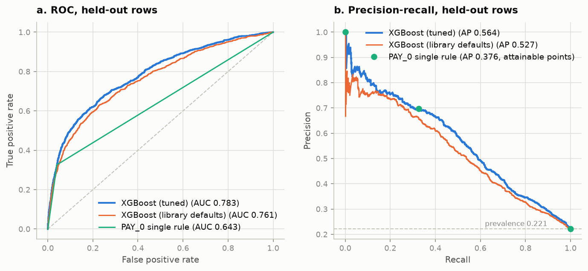

**Figure 4.** Hold-out ROC and precision–recall for the tuned model against two ladder baselines.
The single rule is drawn as its *attainable* operating points rather than as a curve: with two
distinct scores it has one usable point, and joining them would interpolate through (recall,
precision) pairs the rule cannot reach, which is invalid in PR space (Davis & Goadrich, 2006). That
point (recall 0.33, precision 0.70) sits on the tuned curve — **the rule is competitive exactly
there and nowhere else**, which is the operating-point rigidity the cost analysis makes expensive.

**DeLong's paired test** gives **+0.1399** [+0.1268, +0.1531], *p* = 1.5 × 10⁻⁹⁶ against the
single rule and **+0.0222** [+0.0145, +0.0300] against library defaults: **six times more of the
climb comes from being an ensemble than from being a well-tuned one** (§4.1, C.5).

---
## 6. Summary

**Answering the research questions.** Q1: the gain is real but stops early. One readable rule on
`PAY_0` → tuned gradient boosting buys **+0.1399 ROC-AUC**, yet 58% of that climb
arrives by the *linear* rung and the last step from library defaults to tuned XGBoost is worth only
**+0.0222**. It is justified conditionally: interpretability is worth losing when probabilities
feed a decision needing calibrated scores the single rule cannot produce. Q2: SHAP bridges the gap
**partially** — exactly additive (max error 3.7 × 10⁻⁶) and independently recovering the Phase 1
`PAY_0` gradient — but attribution inside the collinear `BILL_AMT` block is unstable (rank SD 1.73),
so those six are auditable only as a group.

**What worked.** The ladder was the right instrument, turning the accuracy–explainability trade-off
from an assertion into a measured axis. Freezing τ = 0.1341 from out-of-fold
probabilities and applying it untouched gave a **33.5% cost reduction** on test, matching the 33.2%
predicted in CV.

**What didn't work.** Every intervention aimed at the class imbalance failed, informatively:
reweighting moved ROC-AUC **+0.0003 against a fold-SD of 0.0071** while worsening ECE from 0.0212 to
**0.2088**, and SMOTE was worse still (0.7681, Brier 0.2200). Isotonic calibration also failed,
making hold-out Brier worse on an already near-calibrated model.

**What surprised me**, in descending order of impact on my view.

*Threshold selection is worth more than the entire hyperparameter search.* One hundred and fifty
Optuna trials bought +0.0222 ROC-AUC; choosing τ from the cost matrix cut cost by a third.

*A model that cannot see sex still reproduces most of the sex disparity.* Deleting the four
demographic columns costs only 0.0013 ROC-AUC, yet **58.0% of the selection-rate gap survives**; the
model also *amplifies*, 3.44 pp observed becoming 8.72 pp selected.

*`PAY_0` = 0 is the strongest negative signal, not `PAY_0` = −2.* Mean SHAP by code runs −0.214,
−0.165, **−0.288**, +0.250, +1.517 for codes −2, −1, 0, 1, 2 — the Phase 1 non-monotonicity
recovered from the model's internals.

*The Bayes-floor argument had to be withdrawn.* I expected Phase 1's 21 contradictory duplicate
groups to set an irreducible error floor; exp14 measures **zero** after de-duplication, so
the ceiling claim now rests on the learning curve (Figure A2): **plateauing near ROC-AUC 0.78 is a
feature-set ceiling, not a model deficiency**, since six months of billing cannot observe job
loss.

One smaller surprise: XGBoost's `weight` importance ranks `PAY_0` **twelfth** while SHAP ranks it
first, so the default importance plot would have inverted this report's central finding.

**Limitations.** The cost matrix is built from published LGD and NIM ranges, not this lender's
figures, so only the *ratio* r ≈ 6 drives the threshold. The dataset is a single six-month window
from one Taiwanese issuer in 2005, so nothing transfers without revalidation. And it establishes
disparity, not legal discrimination.

---
## 7. References

Barocas, S., & Selbst, A. D. (2016). Big data's disparate impact. *California Law Review, 104*(3),
671–732. https://doi.org/10.15779/Z38BG31

Chen, T., & Guestrin, C. (2016). XGBoost: A scalable tree boosting system. In *Proceedings of the
22nd ACM SIGKDD International Conference on Knowledge Discovery and Data Mining* (pp. 785–794).
Association for Computing Machinery. https://doi.org/10.1145/2939672.2939785

Davis, J., & Goadrich, M. (2006). The relationship between precision-recall and ROC curves. In
*Proceedings of the 23rd International Conference on Machine Learning* (pp. 233–240). Association
for Computing Machinery. https://doi.org/10.1145/1143844.1143874

DeLong, E. R., DeLong, D. M., & Clarke-Pearson, D. L. (1988). Comparing the areas under two or more
correlated receiver operating characteristic curves: A nonparametric approach. *Biometrics, 44*(3),
837–845. https://doi.org/10.2307/2531595

Elkan, C. (2001). The foundations of cost-sensitive learning. In *Proceedings of the 17th
International Joint Conference on Artificial Intelligence* (pp. 973–978). Morgan Kaufmann.

Ke, G., Meng, Q., Finley, T., Wang, T., Chen, W., Ma, W., Ye, Q., & Liu, T.-Y. (2017). LightGBM: A
highly efficient gradient boosting decision tree. In *Advances in Neural Information Processing
Systems 30* (pp. 3146–3154). Curran Associates.

Lessmann, S., Baesens, B., Seow, H.-V., & Thomas, L. C. (2015). Benchmarking state-of-the-art
classification algorithms for credit scoring: An update of research. *European Journal of
Operational Research, 247*(1), 124–136. https://doi.org/10.1016/j.ejor.2015.05.030

Lundberg, S. M., Erion, G., Chen, H., DeGrave, A., Prutkin, J. M., Nair, B., Katz, R., Himmelfarb,
J., Bansal, N., & Lee, S.-I. (2020). From local explanations to global understanding with
explainable AI for trees. *Nature Machine Intelligence, 2*(1), 56–67.
https://doi.org/10.1038/s42256-019-0138-9

Lundberg, S. M., & Lee, S.-I. (2017). A unified approach to interpreting model predictions. In
*Advances in Neural Information Processing Systems 30* (pp. 4765–4774). Curran Associates.

Nadeau, C., & Bengio, Y. (2003). Inference for the generalization error. *Machine Learning, 52*(3),
239–281. https://doi.org/10.1023/A:1024068626366

Niculescu-Mizil, A., & Caruana, R. (2005). Predicting good probabilities with supervised learning.
In *Proceedings of the 22nd International Conference on Machine Learning* (pp. 625–632). Association
for Computing Machinery. https://doi.org/10.1145/1102351.1102430

Pedregosa, F., Varoquaux, G., Gramfort, A., Michel, V., Thirion, B., Grisel, O., Blondel, M.,
Prettenhofer, P., Weiss, R., Dubourg, V., Vanderplas, J., Passos, A., Cournapeau, D., Brucher, M.,
Perrot, M., & Duchesnay, É. (2011). Scikit-learn: Machine learning in Python. *Journal of Machine
Learning Research, 12*, 2825–2830.

Prokhorenkova, L., Gusev, G., Vorobev, A., Dorogush, A. V., & Gulin, A. (2018). CatBoost: Unbiased
boosting with categorical features. In *Advances in Neural Information Processing Systems 31*
(pp. 6638–6648). Curran Associates.

Saito, T., & Rehmsmeier, M. (2015). The precision-recall plot is more informative than the ROC plot
when evaluating binary classifiers on imbalanced datasets. *PLoS ONE, 10*(3), e0118432.
https://doi.org/10.1371/journal.pone.0118432

Yeh, I.-C., & Lien, C.-H. (2009). The comparisons of data mining techniques for the predictive
accuracy of probability of default of credit card clients. *Expert Systems with Applications,
36*(2), 2473–2480. https://doi.org/10.1016/j.eswa.2007.12.020

---
<div style="page-break-after: always;"></div>

# Appendix

*The page cap applies to Introduction through References only. Everything below is supporting
material. Appendix B carries the full tables summarised in §5, Appendix C the extended discussion
that the page cap excluded from the body, and Appendix D the source-code listing required by the
brief. Every table is generated from `results/*.json` by `src/report.py`, so no number here is
retyped either.*

## Appendix A — Supporting figures

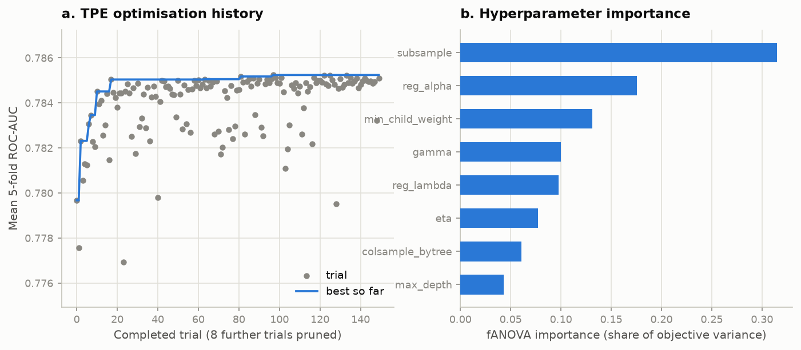

**Figure A1.** Optuna TPE study, 150 trials. Left: optimisation history with the running best, flat
after roughly trial 20 (§4.1). Right: fANOVA parameter importances, which is what justifies calling
`subsample` and the regularisers the high-leverage parameters rather than assuming it.

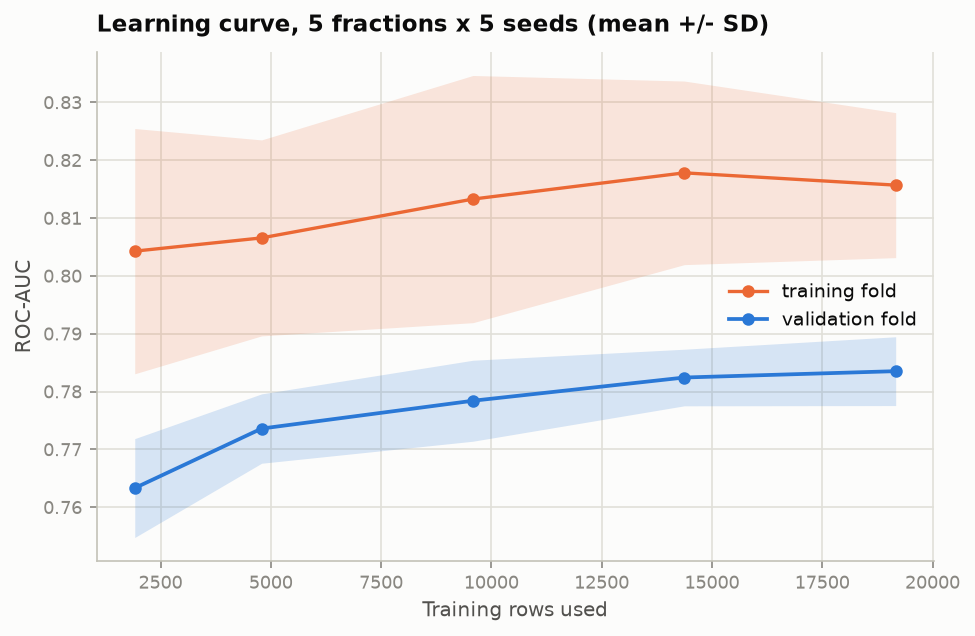

**Figure A2.** Training and validation ROC-AUC against training-set fraction, 5 seeds per fraction.
The validation curve flattens well before the full training set, which is the evidence for the
feature-set-ceiling claim of §6 — more rows of the same kind will not help.

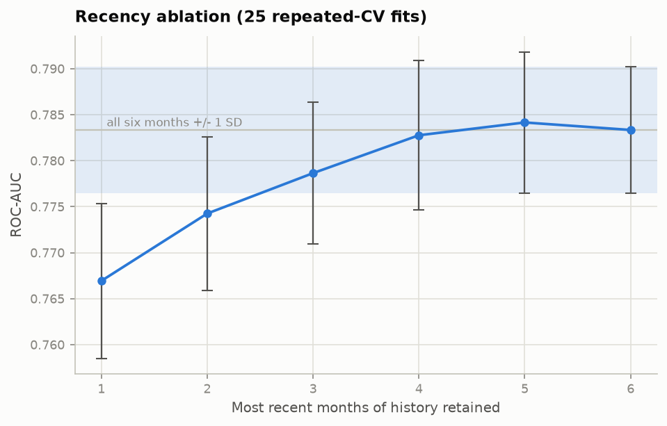

**Figure A3.** Recency ablation: ROC-AUC against months of repayment history retained, in
`PAY_CHRONO` order. Marginal gain decays monotonically and turns negative at the sixth month.

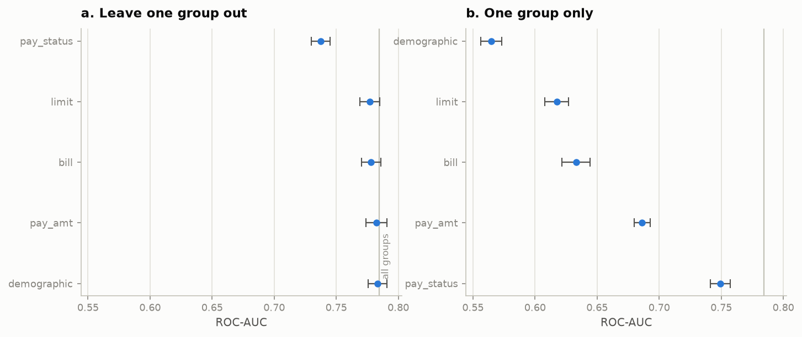

**Figure A4.** Feature-group ablation, all eleven arms. Leave-one-group-out above, only-one-group
below. Dropping repayment status is the only change that exceeds a few fold-SDs.

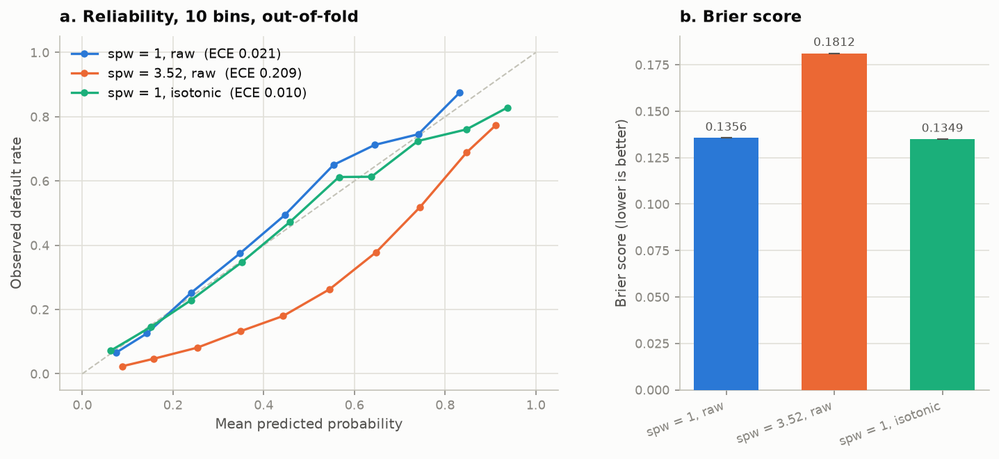

**Figure A5.** Observed default rate against mean predicted probability, 10 bins, out-of-fold, with
Brier scores alongside. The untouched model (ECE 0.021) tracks the diagonal closely. The reweighted
model (ECE 0.209) sits **below** it across the whole range — at a predicted 0.4 only about 0.18 of
those clients default — so it systematically *over*-states risk, which is the calibration damage
§5.3 charges against reweighting and why its Brier score is 34% worse. Isotonic recalibration
(ECE 0.010) restores the diagonal, confirming the distortion is in the scores rather than the
ranking. §5.4's cost analysis runs on the untouched probabilities for this reason.

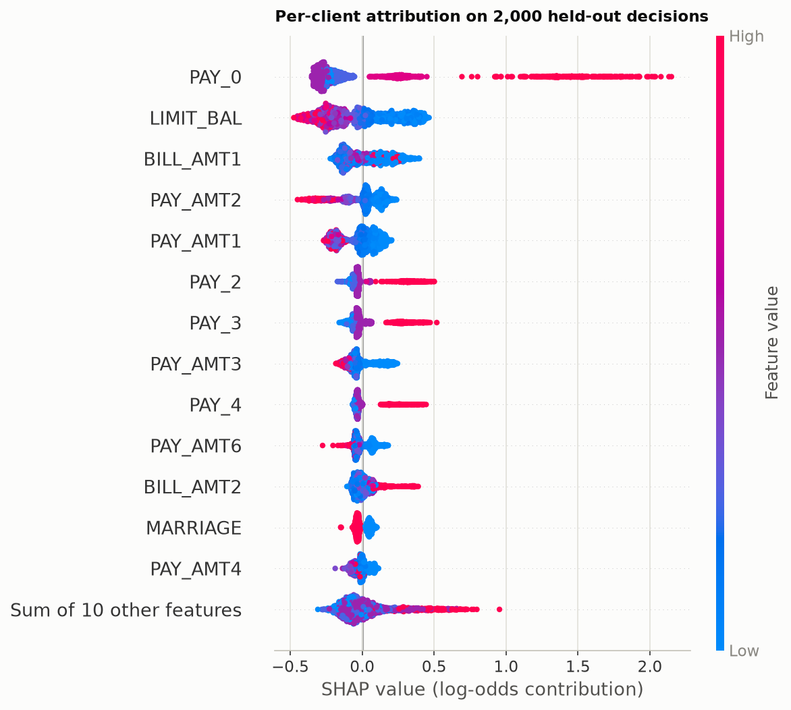

**Figure A6.** TreeSHAP beeswarm on held-out rows, log-odds space, interventional perturbation
against a 1,000-row stratified background. One point per client per feature; colour is the feature
value.

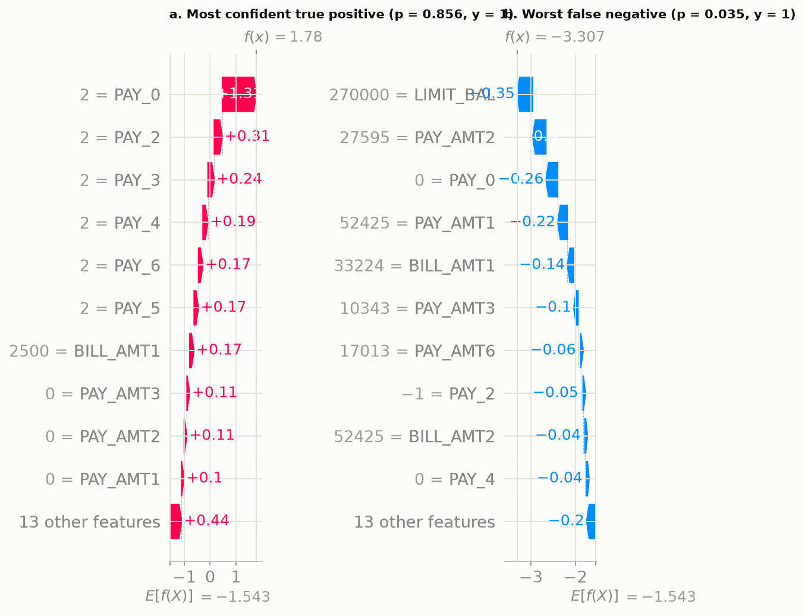

**Figure A7.** SHAP waterfall pair on held-out clients: a correctly identified default at *p* = 0.856
and a **missed** default at *p* = 0.035. The second is the more instructive — it shows the model was
misled by an unremarkable repayment history, which is exactly the kind of failure an audit trail has
to be able to display. Note that these are rendered in probability space for readability, where the
decomposition is no longer exactly additive (§4.5).

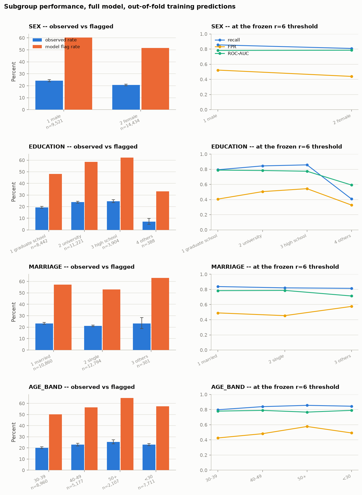

**Figure A8.** Per-subgroup detail for all four protected attributes. Left column: observed default
rate with Wilson 95% intervals against the model's flag rate at the frozen threshold. Right column:
recall, false-positive rate and ROC-AUC per subgroup.

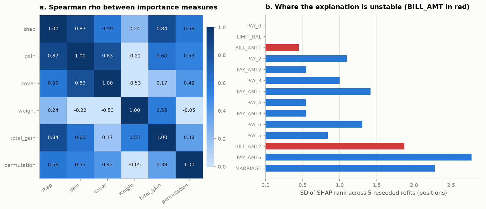

**Figure A9.** Left: Spearman rank agreement between five importance measures. Right: SHAP rank
stability across five reseeded refits. The negative `cover`–`weight` correlation is the result that
makes "just use the built-in importance plot" indefensible (§5.5).

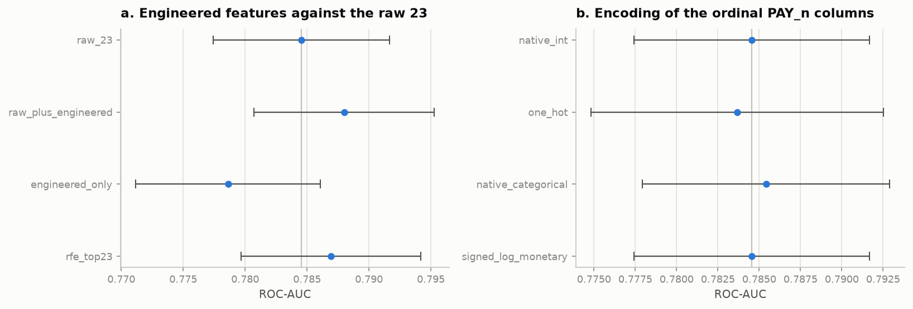

**Figure A10.** Engineered-feature benchmark and encoding ablation with fold-SD intervals. Every arm
in the encoding panel falls inside one SD of the others, which is why native integers are carried
forward on the argument of §4.2 rather than on a score difference.

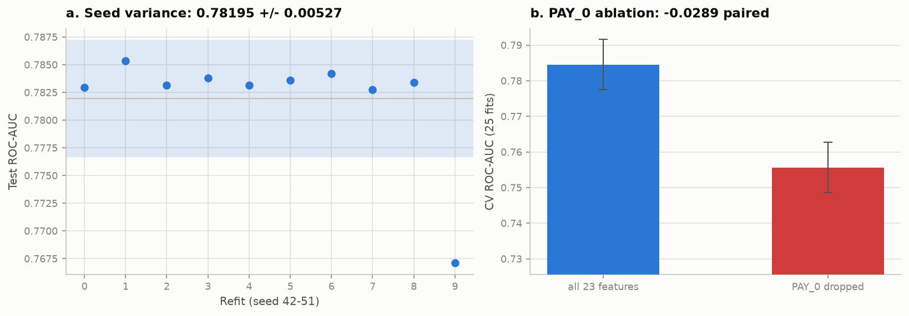

**Figure A11.** Final configuration refit under 10 seeds. Nine cluster tightly; one lands materially
lower, which is why §5.7 reports a spread rather than a single number.

<div style="page-break-after: always;"></div>

## Appendix B — Full tables

**Table B1.** Selected hyperparameters against their searched ranges (§4.1).

| Hyperparameter | Searched range | Type | Selected |
|---|---|---|---|
| `max_depth` | 3 to 8 | int | 6 |
| `eta` | 0.01 to 0.3 (log) | float | 0.012533 |
| `min_child_weight` | 1.0 to 20.0 (log) | float | 4.1899 |
| `subsample` | 0.6 to 1.0 | float | 0.60358 |
| `colsample_bytree` | 0.5 to 1.0 | float | 0.7998 |
| `gamma` | 0.0 to 5.0 | float | 0.695 |
| `reg_lambda` | 0.01 to 100.0 (log) | float | 34.295 |
| `reg_alpha` | 0.001 to 10.0 (log) | float | 0.0015166 |

**Table B2.** Encoding ablation, all four arms (§4.2, §5.2).

| Arm | Features | ROC-AUC | PR-AUC | Brier |
|---|---|---|---|---|
| native_int | 23 | 0.7845 ± 0.0071 | 0.5602 ± 0.0146 | 0.13479 ± 0.00414 |
| one_hot | 79 | 0.7837 ± 0.0089 | 0.5532 ± 0.0182 | 0.13635 ± 0.00758 |
| native_categorical | 23 | 0.7854 ± 0.0075 | 0.5611 ± 0.0145 | 0.13380 ± 0.00228 |
| signed_log_monetary | 23 | 0.7845 ± 0.0071 | 0.5602 ± 0.0146 | 0.13479 ± 0.00414 |

**Table B3.** Engineered-feature benchmark, all four arms (§5.2).

| Arm | Features | ROC-AUC | PR-AUC | Brier |
|---|---|---|---|---|
| raw_23 | 23 | 0.7845 ± 0.0071 | 0.5602 ± 0.0146 | 0.13479 ± 0.00414 |
| raw_plus_engineered | 40 | 0.7880 ± 0.0073 | 0.5624 ± 0.0154 | 0.13618 ± 0.00776 |
| engineered_only | 17 | 0.7786 ± 0.0075 | 0.5416 ± 0.0146 | 0.13742 ± 0.00648 |
| rfe_top23 | 23 | 0.7869 ± 0.0073 | 0.5600 ± 0.0130 | 0.13756 ± 0.00972 |

**Table B4.** Feature-group ablation, all eleven arms (§5.2).

| Arm | Features | ROC-AUC | PR-AUC | Brier |
|---|---|---|---|---|
| all_groups | 23 | 0.7845 ± 0.0071 | 0.5602 ± 0.0146 | 0.13479 ± 0.00414 |
| drop_demographic | 19 | 0.7832 ± 0.0075 | 0.5574 ± 0.0140 | 0.13655 ± 0.00815 |
| drop_limit | 22 | 0.7769 ± 0.0079 | 0.5537 ± 0.0147 | 0.13842 ± 0.00952 |
| drop_pay_status | 17 | 0.7374 ± 0.0075 | 0.4586 ± 0.0139 | 0.14970 ± 0.00402 |
| drop_bill | 17 | 0.7781 ± 0.0076 | 0.5527 ± 0.0160 | 0.13727 ± 0.00809 |
| drop_pay_amt | 17 | 0.7824 ± 0.0086 | 0.5551 ± 0.0185 | 0.13899 ± 0.01116 |
| only_demographic | 4 | 0.5646 ± 0.0086 | 0.2581 ± 0.0081 | 0.17183 ± 0.00036 |
| only_limit | 1 | 0.6175 ± 0.0095 | 0.2966 ± 0.0078 | 0.16943 ± 0.00187 |
| only_pay_status | 6 | 0.7492 ± 0.0080 | 0.5236 ± 0.0154 | 0.14845 ± 0.00863 |
| only_bill | 6 | 0.6331 ± 0.0112 | 0.3338 ± 0.0144 | 0.16568 ± 0.00199 |
| only_pay_amt | 6 | 0.6863 ± 0.0065 | 0.3762 ± 0.0085 | 0.15972 ± 0.00193 |

**Table B5.** Recency ablation, k = 1..6 months (§5.2).

| Arm | Features | ROC-AUC | PR-AUC | Brier |
|---|---|---|---|---|
| k1_months | 8 | 0.7669 ± 0.0084 | 0.5331 ± 0.0164 | 0.14455 ± 0.01190 |
| k2_months | 11 | 0.7743 ± 0.0083 | 0.5428 ± 0.0169 | 0.14012 ± 0.01095 |
| k3_months | 14 | 0.7786 ± 0.0077 | 0.5474 ± 0.0150 | 0.14397 ± 0.01339 |
| k4_months | 17 | 0.7828 ± 0.0081 | 0.5558 ± 0.0186 | 0.13776 ± 0.00862 |
| k5_months | 20 | 0.7842 ± 0.0077 | 0.5589 ± 0.0139 | 0.13558 ± 0.00639 |
| k6_months | 23 | 0.7833 ± 0.0069 | 0.5570 ± 0.0126 | 0.13841 ± 0.00905 |

**Table B6.** Learning curve, mean ± SD per training fraction, 5 seeds each (§6, Figure A2).

| Arm | Features | ROC-AUC |
|---|---|---|
| frac_0.10 | 23 | 0.7633 ± 0.0085 |
| frac_0.25 | 23 | 0.7736 ± 0.0060 |
| frac_0.50 | 23 | 0.7784 ± 0.0070 |
| frac_0.75 | 23 | 0.7824 ± 0.0049 |
| frac_1.00 | 23 | 0.7835 ± 0.0059 |

**Table B7.** Calibration detail (§5.4). Observed prevalence is 0.2212. ECE is the *n*-weighted mean
gap between predicted probability and observed frequency over ten equal-width bins. Each fold's
training half is split again 80/20, so the calibrator is fitted on rows the booster did not train on
and the fold's validation rows stay unseen.

| Arm | Method | Brier | ECE | Mean predicted *p* |
|---|---|---|---|---|
| A (`spw`=1) | raw | 0.1356 | 0.0212 | 0.2189 |
| A | Platt (sigmoid) | 0.1349 | 0.0191 | 0.2217 |
| A | isotonic | 0.1349 | 0.0102 | 0.2218 |
| C (`spw`=3.52) | raw | 0.1812 | **0.2088** | **0.4299** |
| C | Platt (sigmoid) | 0.1346 | 0.0115 | 0.2218 |
| C | isotonic | 0.1348 | **0.0080** | 0.2217 |

**Table B8.** Full per-subgroup fairness detail with Wilson 95% intervals, full model, out-of-fold
predictions at the frozen τ = 0.1341 (§5.6).

| Attribute | Group | n | Observed rate (%) | Wilson 95% CI | ROC-AUC | PR-AUC | Recall | FPR | Flag rate |
|---|---|---|---|---|---|---|---|---|---|
| SEX | 1 male | 9,521 | 24.19 | [23.34, 25.06] | 0.7821 | 0.5719 | 0.8554 | 0.5226 | 0.6031 |
| SEX | 2 female | 14,434 | 20.75 | [20.10, 21.42] | 0.7851 | 0.5523 | 0.8083 | 0.4393 | 0.5159 |
| EDUCATION | 1 graduate school | 8,442 | 19.38 | [18.55, 20.24] | 0.7888 | 0.5393 | 0.7934 | 0.4063 | 0.4813 |
| EDUCATION | 2 university | 11,221 | 23.80 | [23.02, 24.60] | 0.7834 | 0.5794 | 0.8443 | 0.5048 | 0.5856 |
| EDUCATION | 3 high school | 3,904 | 24.69 | [23.37, 26.07] | 0.7738 | 0.5630 | 0.8579 | 0.5435 | 0.6212 |
| EDUCATION | 4 others | 388 | 6.96 | [4.83, 9.94] | 0.5914 | 0.1567 | 0.4074 | 0.3269 | 0.3325 |
| MARRIAGE | 1 married | 10,860 | 23.33 | [22.55, 24.14] | 0.7838 | 0.5770 | 0.8378 | 0.4900 | 0.5712 |
| MARRIAGE | 2 single | 12,794 | 21.06 | [20.36, 21.77] | 0.7871 | 0.5479 | 0.8207 | 0.4539 | 0.5311 |
| MARRIAGE | 3 others | 301 | 23.26 | [18.84, 28.35] | 0.7134 | 0.4800 | 0.8143 | 0.5758 | 0.6312 |
| AGE_BAND | <30 | 7,711 | 22.98 | [22.05, 23.93] | 0.7898 | 0.5775 | 0.8448 | 0.4917 | 0.5728 |
| AGE_BAND | 30–39 | 8,960 | 20.12 | [19.31, 20.97] | 0.7801 | 0.5254 | 0.7981 | 0.4259 | 0.5008 |
| AGE_BAND | 40–49 | 5,177 | 22.95 | [21.82, 24.11] | 0.7896 | 0.5783 | 0.8392 | 0.4818 | 0.5638 |
| AGE_BAND | 50+ | 2,107 | 25.39 | [23.58, 27.29] | 0.7668 | 0.5870 | 0.8561 | 0.5770 | 0.6478 |

**Table B9.** What each rung of the ladder buys (§5.1).

| Increment | Δ ROC-AUC | Reading |
|---|---|---|
| Majority → one rule on `PAY_0` | +0.1441 | One column carries most of the available signal |
| One rule → rank on the raw code | +0.0469 | The price of a *readable* rule |
| `PAY_0` score → linear, 23 features | +0.0338 | What 22 more features buy a linear model |
| Linear → single tree | +0.0294 | What non-linearity and interactions buy |
| Single tree → random forest | +0.0099 | What bagging buys — barely one fold-SD |
| Forest → tuned XGBoost | +0.0204 | What boosting plus tuning buys beyond bagging |
| **One readable rule → tuned XGBoost** | **+0.1404** | The total on offer for abandoning direct interpretability |

**Table B10.** Experiment runtimes and reproduction manifest. Wall clock on the reference machine
(Windows 11, 8 physical cores, `tree_method="hist"`, 23,955 training rows). These are the
`runtime_sec` fields of `results/*.json`, so they are measurements rather than estimates.

| Experiment | Title | Rows | Runtime (s) | Run (UTC) |
|---|---|---|---|---|
| exp01_ladder | Complexity ladder: capability against interpretability | 8 | 104.9 | 2026-09-30T09:15:03Z |
| exp02_tuning | Hyperparameter search (Optuna TPE) | 2 | 1166.3 | 2026-09-30T08:58:21Z |
| exp03_imbalance | Class-imbalance strategy comparison | 5 | 302.0 | 2026-09-30T09:47:34Z |
| exp04_encoding | Encoding ablation for repayment-status columns | 4 | 186.1 | 2026-09-30T09:03:53Z |
| exp05_engineered | Engineered-feature benchmark | 4 | 165.7 | 2026-09-30T09:06:41Z |
| exp06_groups | Feature-group ablation | 11 | 297.7 | 2026-09-30T09:11:42Z |
| exp07_recency | Recency ablation: months of history required | 6 | 235.8 | 2026-09-30T09:15:40Z |
| exp08_learning_curve | Learning curve against training-set size | 5 | 120.7 | 2026-09-30T09:17:44Z |
| exp09_calibration | Calibration: Brier, ECE and reliability curves | 6 | 16.0 | 2026-09-30T09:47:53Z |
| exp10_cost | Cost-sensitive threshold selection with Elkan overlay | 18 | 0.9 | 2026-09-30T09:47:56Z |
| exp11_shap | TreeSHAP attribution on held-out decisions | 23 | 26.8 | 2026-09-30T09:35:29Z |
| exp12_stability | Explanation stability and importance-measure agreement | 23 | 76.1 | 2026-09-30T09:36:47Z |
| exp13_fairness | Fairness and subgroup analysis | 8 | 7.3 | 2026-09-30T09:48:06Z |
| exp14_final | Robustness checks and final held-out evaluation | 7 | 148.9 | 2026-09-30T09:52:59Z |
| | **Total, run serially** | **130** | **≈2,856 (48 min)** | |

<div style="page-break-after: always;"></div>

## Appendix C — Extended discussion

*Material cut from the body for the page cap. Nothing here is a new result; each note expands an
argument §5 states in one sentence.*

### C.1 Why the 6-month recency arm does not match the baseline

The 6-month arm of Table B5 uses the same 23 features as the baseline yet scores 0.7833 against the
baseline's 0.7845. The two are not a contradiction. That arm feeds the columns in *chronological*
order, and because `colsample_bytree` = 0.80 samples columns by index, a reordering changes which
subsets each tree sees and therefore fits a different model. The 0.0012 difference is well inside
fold noise, but it is a useful reminder that column order is not inert once column subsampling is
switched on — and a trap for anyone who assumes a permutation of identical features must reproduce
an identical score.

### C.2 The `EDUCATION` "others" group, and why it is reported rather than suppressed

The headline `EDUCATION` ROC-AUC gap of 0.197 is almost entirely attributable to category 4,
"others": *n* = 388, a 6.96% observed default rate against 19–25% in the three substantive levels,
and per-group ROC-AUC of 0.591. Its Wilson interval is [4.83, 9.94], so the low rate is real rather
than a small-sample artefact, but the group is small enough that per-group ranking is poorly
estimated. Excluding it, the AUC gap across graduate school, university and high school is **0.015**.
Both numbers are reported because each alone misleads: the headline gap without the decomposition
overstates the problem, and suppressing the group understates it. The four-fifths ratio behaves the
same way — 0.535 including "others", 0.775 excluding it, which still fails.

### C.3 Why the instance-weighted cost scheme reports one number rather than six

`cost_at_threshold` under the instance-weighted scheme charges a false negative LGD × `LIMIT_BAL` and
a false positive NIM × `LIMIT_BAL` for each client directly. The ratio r = LGD/NIM is therefore
already embedded in those two constants, and sweeping r does not change the objective — the optimiser
reproduces τ = 0.1621 at every rung of the sweep. Reporting one value rather than six identical rows
is the honest presentation, but the mechanism is worth stating because a reader who expects the
instance-weighted column to track the flat column across r would otherwise read the constant as a
bug.

### C.4 The accuracy trap, stated at length

Rung 0 of Table 1 predicts "no default" for every client and scores 77.88% accuracy with zero recall,
which is exactly $1 - 0.2211$, the majority-class rate. The more damning observation is the `Acc @0.5`
column read downward: from rung 1 to rung 6 accuracy moves only between 0.8094 and 0.8197 — a span of
one percentage point — while ROC-AUC moves from 0.6441 to 0.7845 and PR-AUC from 0.3774 to 0.5602. A
report leading with accuracy on this dataset would be reporting noise, and would rank a one-line rule
as 98.7% of the way to a tuned ensemble. This is the concrete reason §3.4 selects ROC-AUC as the
tuning objective and §4.4 optimises expected cost for the operating point.

### C.5 Nadeau–Bengio and the `PAY_0`-dropped comparison

Dropping `PAY_0` costs −0.0289 ROC-AUC measured as a paired difference over the 25 repeated-CV folds,
with *t* = −30.8. That *t*-statistic is reported here rather than in the body because it is not
trustworthy at face value: repeated-CV folds overlap, so the paired *t*-test is anti-conservative
(Nadeau & Bengio, 2003) and the nominal *p*-value is far smaller than the evidence warrants. The
effect size (−0.0289, against a fold-SD of ~0.007) is the reportable quantity, and the hold-out
DeLong test (−0.0311, *p* = 6.6 × 10⁻¹⁵) is the comparison that does license an inferential claim,
because it is computed once on independent rows.

### C.6 What the verification gate checks

`experiments/verify.py` runs ten checks and all ten pass. Phase 1 assertions hold (29,944 rows,
6,622 defaults, 22.1146% prevalence, `EDUCATION ⊆ {1,2,3,4}`, `MARRIAGE ⊆ {1,2,3}`). There are zero
duplicate feature-rows after cleaning. Splits are 23,955/5,989 with **index overlap 0** and a
prevalence gap of 0.00009 across every fold. Splits reproduce exactly at `SEED = 42`. All fourteen
result files validate against the documented result schema with non-empty `notes`. All thirty recorded thresholds
are scalars in $(0,1)$. Every `test` block outside `exp14_final` is `null`. SHAP values sum to the
model margin with a maximum error of 3.69 × 10⁻⁶. And the leakage audit confirms the hold-out is
referenced only in `exp11_shap.py`, `exp12_stability.py`, `exp14_final.py` and `figures.py`.

### C.7 Deviations from the project plan, recorded

Two, both recorded rather than quietly absorbed. The plan's work package for feature engineering
specified that `engineer()` would add **21** columns, but the feature table in the same package
enumerates **17** (six `UTIL_n`, six `PAY_RATIO_n`, `N_DELINQ`, `MAX_DELINQ`, `DELINQ_TREND`,
`BILL_TREND`, `MONTHS_DORMANT`). Seventeen is what is implemented and asserted in `src/data.py`; the
21 was an arithmetic slip in the plan, not a dropped feature. And the Optuna trial budget was raised
from the planned 60–80 to **150** on measured evidence (§4.1).

### C.8 Extended Solution discussion (§2–§4)

The body of §2–§4 states each design argument in condensed form to respect the page cap. The
paragraphs below are the full pre-trim wording of those same arguments, retained verbatim so that
no claim, number or citation is lost. They add no new results; they expand the reasoning. Tables,
code blocks and display equations are not duplicated here — those stayed in the body.

#### §2
XGBoost (Chen & Guestrin, 2016) is a gradient-boosted decision tree library, chosen because Phase 1 established two properties of this dataset that point directly at it. The response to repayment status `PAY_n` is **non-monotonic** — default *falls* from 16.8% for clients who paid in full to 12.8% for clients revolving a balance, then climbs to 69.2% at two months late — and the monetary columns are **severely collinear** (`BILL_AMT1–6` carry VIF 13.9–25.7). A non-linear, axis-aligned learner handles the first natively and is indifferent to the second.

#### §2.1
A clarification on scope: the *algorithm* was fixed by the Phase 1 group allocation — this submission implements XGBoost while teammates implement a Decision Tree and a Logistic Regression. What was genuinely open, and what §2.1 investigates, is which **library** to implement it with, since four mature Python packages offer gradient-boosted trees and the choice has real consequences for what the rest of the report can do.

**Why not `lightgbm`.** Its two signature mechanisms are Gradient-based One-Side Sampling, which retains large-gradient rows and subsamples small-gradient ones, and Exclusive Feature Bundling, which packs mutually exclusive sparse features into single columns. Both target a regime this dataset is not in: GOSS pays off when $n$ is large enough that a full gradient pass dominates runtime, and EFB when the design matrix is wide and sparse. Here $n = 29{,}944$ with 23 dense columns, so neither engages, while leaf-wise growth with an unbounded `num_leaves` is the documented overfitting risk on smaller data and would have added a failure mode for no measurable gain.

**Why not `catboost`.** Ordered boosting and ordered target statistics exist to defuse the target leakage that arises when categorical columns are target-encoded, and to reduce prediction shift. Our categoricals top out at four levels and are one-hot encodable — §4.2 tests exactly this and finds the choice immaterial — so the machinery has nothing to act on. Its default oblivious (symmetric) trees are additionally a *structural constraint*, which would have confounded Q1: the capability ladder of §5.1 is meant to measure what unconstrained boosting buys over a single tree, not what a particular symmetry restriction costs.

**Why not `sklearn.ensemble.HistGradientBoostingClassifier`.** It is the one option carrying no extra dependency, which is a genuine advantage. But it exposes `l2_regularization` alone among the penalty terms — there is no $\gamma$ equivalent and no L1 — so `SEARCH_SPACE` would have collapsed from eight dimensions to roughly five. The central §4.1 finding, that this dataset is noise-limited and that the *regularisation* parameters rather than the capacity parameters carry the objective variance, is not a finding that could have been reached with it.

**What `xgboost` buys.** Beyond the regularisation surface, the decisive factor is Q2. Interventional TreeSHAP against a background sample is the project's hardest technical requirement, and `shap`'s support for the `xgboost` backend is the longest-standing and most exercised of the four — §2.5 records that even on this path a version interaction made it fail outright, which is an argument for choosing the best-supported backend rather than against it.

#### §2.2
The nine entry points in the body table are the complete set the project touches; nothing else in the `xgboost` namespace is called. Two absences are deliberate rather than incidental. `xgboost.train()` with an explicitly constructed `DMatrix` is the native interface and is what most tutorials show, but it is not scikit-learn compatible, and compatibility is load-bearing here: `runner.cv_evaluate()` passes estimators to scikit-learn's splitters and §4.3 wraps one inside an `imblearn.Pipeline` so that SMOTE resamples per fold. Writing to the native interface would have meant reimplementing both. Nothing is lost by avoiding it, because `hist` materialises a `QuantileDMatrix` internally regardless — the bin sketch is built directly from the input frame, skipping the dense intermediate copy a hand-built `DMatrix` allocates.

#### §2.3
The library's penalty is a **superset** of the one derived in the theoretical overview: alongside $\gamma T$ and the L2 term it exposes an L1 shrinkage on leaf weights, so in implementation $\Omega(f) = \gamma T + \tfrac{1}{2}\lambda \|w\|^2 + \alpha\|w\|_1$. The extra term is reachable as `reg_alpha` and was included in the search space for completeness; the tuner drove it to **0.0015**, effectively off, which is the expected outcome on 23 dense columns where there is no sparse coefficient vector to prune.

Two of the eight searched arguments behave in ways the derivation alone does not predict, and both matter at 22.11% prevalence. **`min_child_weight` floors $\sum h_i$ in a child, not the row count.** For log-loss $h_i = p_i(1-p_i)$, so the Hessian measures *prediction uncertainty*: rows the model is already confident about contribute almost nothing to $H$. A leaf holding fifty confidently-classified rows is therefore cheap, while a leaf holding fifty uncertain ones is expensive — which is precisely the guard needed against leaves that look pure only because they are small and minority-heavy. Reading the argument as a minimum sample size, as its name invites, gets the mechanism backwards. **And `reg_lambda` sits in the *denominator* of the Gain expression**, so it discounts a split in proportion to how little Hessian mass supports it. That is a softer and better-targeted control than `max_depth`, which truncates structure uniformly regardless of how well-evidenced it is; it is also why §4.1 finds the tuner leaning hard on $\lambda = 34.3$ while ranking `max_depth` *last* by fANOVA importance.

One API trap worth recording: `eta`/`learning_rate`, `reg_lambda`/`lambda` and `reg_alpha`/`alpha` are alias pairs, and passing both members of a pair silently keeps one without warning. The project writes the native booster names only. `SEARCH_SPACE` in `config.py` is the single declarative source of the ranges — `tuning.py` suggests from it and the report table is printed from it — so the documented search cannot drift from the search that actually ran.

#### §2.4
Exact greedy split finding sorts every feature at every node, costing $O(n \log n)$ per feature. `tree_method="hist"` buckets each feature into at most 256 bins once, then accumulates $(G, H)$ per bin, dropping this to $O(n)$ per feature per node after a one-off binning pass. The approximation is *free* here rather than merely cheap, for a reason specific to the data: the six `PAY_n` columns take eleven distinct integer values ($-2$ to $8$) and `EDUCATION`, `MARRIAGE` and `SEX` take two to four, so all are **exactly representable** in 256 bins and no candidate split is lost. Only the monetary columns bin lossily, and their splits are coarse anyway. This is what made a 150-trial search affordable at ~2.3 s per trial.

On the second decision: at each split XGBoost learns a **default direction** for missing values, enumerating candidate splits twice, sending `NaN` left then right, and keeping the higher gain. Missing rows are therefore neither imputed nor dropped — their routing is *fitted*. This is why `src/data.py::engineer()` is written as it is. Phase 1 documented 1,930 rows with negative `BILL_AMT`, for which `PAY_AMT / BILL_AMT` is semantically undefined: a negative bill is a credit balance, so "what fraction did they repay" has no answer, and imputing zero would assert *no repayment* — a different and false claim.

Substituting `np.nan` *before* dividing rather than guarding after it is load-bearing: it yields `NaN` rather than $\pm\infty$, and an infinity would propagate into the histogram binning described above. `engineer()` asserts the added block is finite-or-`NaN` for exactly this reason. `NaN` also carries strictly more information than an arbitrary fill, because a fill asserts a fact about the client that the data does not support.

#### §2.5
Two version-specific details are worth recording because both fail *silently*. **`early_stopping_rounds` and `eval_metric` moved to the constructor** in XGBoost 2.0, so following older tutorials leaves the booster quietly optimising the default metric. And **`enable_categorical` now defaults to `True`** — `shap` 0.52 inspects that flag alone, not whether any column is actually `category` dtype, and refuses interventional TreeSHAP with `NotImplementedError: Categorical split is not yet supported`. Every numeric model here pins it `False`; only the `enable_categorical=True` encoding arm (§4.2) sets it, and that arm is deliberately not the one explained with SHAP. `n_estimators` is never tuned: it is capped at 2,000 and decided by early stopping against an inner slice (§3.2), because the optimal number of rounds is a function of `eta` and so not independently searchable.

#### §3
Everything in §3 is binding on all fourteen experiments.

#### §3.1
Phase 1 found 108 rows in 52 duplicate groups, 21 carrying **contradictory labels** (identical values across all 23 features, different outcomes). De-duplication therefore happens *before* the split; had it happened after, identical feature rows would straddle the boundary and the model would be scored partly on rows it had memorised. The hold-out is then 80/20 stratified on `DEFAULT` at `random_state=42` → 23,955 train / 5,989 test; with 1,324 test positives the standard error on AUC is ≈0.007, tight enough to resolve the differences this report claims.

Tuning uses `StratifiedKFold(5, shuffle=True, random_state=42)` on the training portion only. Variance is reported from `RepeatedStratifiedKFold(5 × 5, random_state=7)`, refitting only the *selected* configuration → 25 fits, mean ± SD. The two random states differ deliberately: reusing `42` for the variance folds would correlate them with the folds the tuner selected against, so the reported SD would understate true variability. Repeated CV is used for *reporting* and never inside the tuner, where it would cost 5× the runtime for a noisier selection signal.

#### §3.2
Early stopping needs a validation signal and the obvious sources are both wrong: the test set is leakage, and the CV validation fold is subtler leakage, since the fold used to *score* a configuration must not also decide when to stop fitting it. The implementation carves a stratified **15% slice out of each training fold**:

This function is the project's leakage boundary and it exists in exactly one place. All fourteen experiments call `runner.cv_evaluate()`, which calls `fit_one()`; no experiment writes its own CV loop, and divergent evaluation loops are the single largest source of numbers that fail to reconcile across a multi-experiment study. Test-set access is enforced structurally as well: `src/data.py` exposes `training_context()`, returning *only* `X`, `y` and the fold objects, and a separate `test_context()`. An experiment that never calls the latter cannot touch the hold-out. Only `exp14_final` and the two SHAP experiments — which *explain* held-out decisions without selecting anything — import it, so the audit is a single grep (§5.7).

#### §3.3
The most common fatal flaw in this kind of assignment is sweeping the decision threshold against test labels and reporting the best result. The procedure here generates **out-of-fold** probabilities on the training portion via `cross_val_predict`, minimises expected cost over a 501-point grid on *those* probabilities, **freezes the winner as a scalar** with an assertion that it lies in $(0,1)$, and applies it unmodified to the test set. The threshold is a hyperparameter like any other, so it is chosen on training data and the test set sees one number it did not help select. Every decision uses `predict_proba(X)[:, 1] >= tau`, never `model.predict()`, which would silently reimpose 0.5.

#### §3.4
ROC-AUC is the declared primary metric for three reasons: it is the standard in the credit-scoring benchmark literature (Lessmann et al., 2015), making these numbers comparable outside this report; it is **prevalence-independent**, so it is comparable across the ladder of §5.1 and the fairness subgroups of §5.6, where prevalence differs by construction; and it has lower fold-to-fold variance than PR-AUC, so a fixed trial budget resolves smaller differences. `aucpr` is logged every trial and reported but not optimised, and because PR-space interpolation is invalid for a classifier with few distinct scores (Davis & Goadrich, 2006; Saito & Rehmsmeier, 2015), PR curves are drawn as attainable points wherever that applies.

That choice has a consequence for `scale_pos_weight`. ROC-AUC is invariant to any monotone transformation of the scores, and `scale_pos_weight` rescales positive-class gradients — shifting the *score scale* while leaving the *ranking* almost unchanged. A tuner optimising ROC-AUC is therefore nearly blind to it, would pick a value essentially at random, and that arbitrary value would be confounded with every other hyperparameter in the same search. So `scale_pos_weight` is excluded from the search space, fixed *per arm*, and each arm tuned independently — which converts the imbalance study from a confound into a controlled comparison. The corollary matters for reading §5.3: taking "ROC-AUC barely moved when I set `scale_pos_weight`" as "reweighting worked" is backwards. It means the metric is insensitive to it.

#### §3.6
Every metric is mean ± SD over the 25 repeated-CV fits — SD, not standard error, so the number describes fold-to-fold variability rather than being artificially shrunk by $\sqrt{n}$. **No difference smaller than one fold-SD is bolded or called an improvement**; several results in §5 are reported as indistinguishable for exactly this reason. DeLong's test (DeLong et al., 1988) is applied to one class of comparison only — paired, correlated ROC curves on the single hold-out — and never across CV folds, where the samples are not independent. Arm-versus-arm comparisons use paired per-fold differences with the Nadeau and Bengio (2003) caveat noted: repeated-CV *t*-tests are anti-conservative because folds overlap, so the effect size rather than the *p*-value is the reportable quantity.

#### §4
§3 fixed the protocol; §4 justifies the modelling decisions, each of which is the *reason* behind a number in §5. Appendix C expands the arguments compressed here.

#### §4.1
Optuna's **TPE sampler** (`multivariate=True`) with a `MedianPruner` was used rather than grid or random search: across eight dimensions even three values per parameter is $3^8 = 6{,}561$ configurations, and random search needs roughly 3× the trials of TPE for equal quality because it does not exploit structure it has already seen. The study persists to `artifacts/optuna_study.db`, so it resumes after interruption and the history and fANOVA importances are available (Figure A1). *Deviation from plan:* 60–80 trials were budgeted at an estimated 15–30 s each; measured cost was ~2.3 s, because `hist` binning plus early stopping makes each 5-fold evaluation cheap, so the budget was raised to **150 trials** (142 completed, 8 pruned, 1,166 s).

`eta` sits at the *bottom* of its range, `subsample` at the bottom of its, and `reg_lambda` high in a log range reaching 100. Read through the Gain formula, the tuner converged on a **slow-learning, heavily regularised** configuration — many small trees on ~60% of rows and 80% of columns, with the $\lambda$ denominator discounting splits resting on little Hessian mass. That is the signature of **modest signal relative to noise**; separable structure tunes toward larger `eta` and weaker regularisation. **fANOVA importance** (Figure A1b) agrees independently, ranking `subsample` first at 0.31 of objective variance and **`max_depth` last at 0.04**: the parameters that matter are the *variance-reduction* ones, so the model is noise-limited, not capacity-limited. The plan predicted `min_child_weight` would dominate on the Hessian-floor argument; it placed third (C.1).

**How much did tuning matter?** The history is flat after roughly trial 20 and the *entire* search spans 0.776–0.785 ROC-AUC — **smaller than the 0.0107 pooled fold-SD**. Once inside a sensible space, which point the configuration lands on is indistinguishable from fold noise. That does not contradict the +0.0226 tuning gain of §5.1: library defaults sit *outside* this space (100 fixed rounds at `eta` = 0.3, no early stopping), so **most of the gain is bought by early stopping and a low `eta`, not by locating a precise optimum in eight dimensions.**

#### §4.2
Phase 1 established that `PAY_n` is non-monotonic and categorical-ish, conventionally an argument for one-hot encoding. That argument was tested against native integers, `enable_categorical=True`, and a signed-log transform of the monetary columns (Table B2). **Native integers are carried forward** on three grounds rather than on a score difference, since §5.2 shows the arms are indistinguishable. Trees split axis-alignedly, so a non-monotonic response is recoverable by *stacked* splits — `PAY_0 < 0.5`, then `PAY_0 < -1.5` — meaning one-hot buys only expressible functions integers already reach, at a cost in depth. Integers keep the six `PAY_n` distinct where one-hot's 66 dummies fragment them, protecting the recency gradient (ρ 0.143 → 0.292). And 23 features rather than 79 keeps SHAP attributions readable, which matters for Q2.

The signed-log arm settles a Phase 1 recommendation empirically: monotone rescaling cannot change which rows fall either side of an axis-aligned split, so the advice to apply a robust scaler (skewness up to 30.4) was correct *for distance- and gradient-based learners* and inapplicable here. By the same logic `BILL_AMT1–6` are **kept** despite VIF 13.9–25.7 — collinearity inflates coefficient variance, and trees have no coefficients. What it damages is *attribution*, a §4.5 caveat rather than a reason to discard signal.

#### §4.3
At 22.11% prevalence the data is mildly imbalanced — enough to break accuracy, not enough to break learning. Four arms were run under the controlled protocol of §3.4: baseline at τ = 0.5; the same fitted model with τ moved; `scale_pos_weight` = 3.52 (neg/pos) at τ = 0.5 and with τ re-tuned; and SMOTE inside an `imblearn.Pipeline`, so oversampling happens per-fold on the training half only.

The claim §5.3 tests is that **reweighting is threshold-moving performed indirectly, with the probabilities damaged on the way through.** Multiplying the positive-class gradient inflates every predicted probability without changing the rate at which defaults occur, so the boundary shifts — what practitioners observe and call success — while probability semantics are destroyed. Both routes reach the same operating point; only one preserves scores that mean what they say, and §4.4's cost analysis consumes probabilities. **SMOTE is rejected on dataset-specific grounds**, and was run first so the rejection rests on a measured row: averaging a client at `PAY_0` = 0 with one at `PAY_0` = 1 yields `PAY_0` = 0.37 — a code that does not exist, placed precisely in the interval where Phase 1 measured the response to be non-monotonic. Those rows are not merely noisy; they are drawn from a region where the feature has no meaning. `max_delta_step` is dismissed similarly: it exists for imbalance beyond roughly 100:1, where the logistic Hessian underflows.

#### §4.4
The cost ratio is anchored rather than invented. A false negative costs LGD × EAD, the unrecovered balance, with retail-unsecured LGD ≈ **0.70**; a false positive costs the forgone net interest margin on a customer who would have repaid, NIM ≈ **0.12**. That gives r = 0.70/0.12 = **5.83**, reported as **6:1**, and r is swept over {1, 2, 5, 6, 10, 20} so no conclusion rests on one guess.

Elkan's (2001) analytic optimum is $p^* = 1/(1+r)$ — 0.143 at r = 6. Comparing it against the empirically cost-minimising out-of-fold threshold is not a formality: Elkan's derivation *assumes true posterior probabilities* and says nothing about a model that merely ranks. Agreement between the empirical and analytic curves is therefore independent evidence of calibration obtained without a Brier score, and if isotonic recalibration *tightens* that agreement the mechanism is confirmed rather than merely consistent (§5.4). A second scheme charges each error against the client's `LIMIT_BAL` as an EAD proxy so cost sums over clients rather than count × constant; both are reported, but the flat scheme is frozen and carried to the hold-out because it is what the cost matrix defines. The proposal's 9.8-million-customer and NT$1.17bn figures are **motivation for caring about cost asymmetry**, never a result of this model.

#### §4.5
Q2 asks for *regulatory-compliant decision auditability*, which is three questions, to be answered in order: are the explanations **exact**, **reproducible**, and **true of the data** rather than merely true of the model. Each drives a configuration choice.

*Exactness* requires **log-odds (margin) space**, where the additive decomposition is exact; probability space is not additive, so that transform is applied only for the single-client waterfall and the non-additivity noted there. `feature_perturbation="interventional"` against a 1,000-row stratified background is preferred to `tree_path_dependent` because it estimates the interventional expectation rather than one weighted by the training distribution's split frequencies (Lundberg et al., 2020); both are computed and their agreement reported, so the choice is not load-bearing.

*Reproducibility* is the criterion an audit trail actually needs, and is why exp12 exists: five reseeded refits compared by Spearman ρ between mean|SHAP| vectors and by top-10 Jaccard — the concern the proposal raised about SHAP stability in credit risk, operationalised. The same experiment ranks features by five measures, because these routinely disagree and arguing which to trust is part of the answer. SHAP and permutation importance are preferred because both are evaluated on unseen rows and both answer a question about *predictions*, whereas `gain` and `cover` come from training-loss reduction and `weight` merely counts splits.

*Truth about the data* is tested by explaining the **held-out** set (a 2,000-row stratified sample) rather than training rows — explaining decisions the model has never seen is the whole auditability argument — then checking whether mean SHAP per `PAY_0` code reproduces the Phase 1 non-monotonicity the model was never told about. Two caveats travel with any such claim: `BILL_AMT1–6` collinearity (§4.2) means SHAP divides credit arbitrarily among interchangeable columns, so those six are defensible only as a *group total*; and SHAP attributes the **model's output, not a causal mechanism**.

#### §4.6
Phase 1 committed to a fairness check because *"quantifying them before modelling begins is what makes a later fairness check interpretable rather than merely alarming."* The question is not whether disparities appear in the output — they will, because they exist in the data — but whether the model **amplifies, preserves or attenuates** them, which requires comparing observed default-rate gaps against *selection*-rate gaps at the deployed threshold. Metrics are computed on out-of-fold training predictions at the frozen τ rather than the hold-out: nothing is selected here, and OOF gives subgroup samples roughly four times larger, so the Wilson intervals ported from Phase 1 are tighter. The four-fifths rule — a selection-rate ratio below 0.80 — is the conventional adverse-impact screen. Finally, because §5.2 shows the demographic columns are nearly free to discard, the interesting test is whether removing them removes their *influence*, so the no-demographics arm is re-audited against the same subgroups. If the financial columns proxy for demographics, deleting the protected columns removes the *audit trail* for that influence rather than the influence itself — strictly worse (Barocas & Selbst, 2016).

<div style="page-break-after: always;"></div>

### C.9 Extended results discussion (§5–§6)

As with C.8, these are the full pre-trim readings of the results that §5 and §6 now state tersely.
Every number traces to the same `results/*.json` rows cited in the body.

#### §5
Every number here is read programmatically from `results/*.json` by `src/report.py`; none is
retyped. CV figures are mean ± SD over the same 25 fits, and per §3.6 differences under one fold-SD
are called indistinguishable and never bolded. The *reasoning* is in §2–§4; Appendix C expands these
readings and Appendix B carries the full tables.

#### §5.1
**Table 1.** Eight rungs. "Read" is the parameters, rules or nodes needed to reproduce one decision.
Rungs 2–3 are untuned internal references (§1), not teammates' work.

**Accuracy cannot separate a one-line rule from a tuned ensemble here:** it spans 0.8094–0.8197
while ROC-AUC spans 0.6441–0.7845 (C.4). **The lost Phase 1 benchmark of 0.690 was a ranking, not a
rule:** a depth-1 tree on `PAY_0` scores 0.6441 because one split binarises the code, while ranking
on the raw code with nothing fitted (rung 1b) scores **0.6910** — the **+0.0469** between them is
the measured price of insisting on a single readable rule. **Untuned XGBoost does not beat the
random forest** (0.7619 vs 0.7641, inside one fold-SD), so the XGBoost advantage is a *tuning*
advantage, not an architectural one — yet the forest needs **692,674 nodes** against tuned
XGBoost's **499** for a higher score. **Tuning is the largest single gain in the project,
+0.0226 against a pooled fold-SD of 0.0107** (≈2.1 SD), improving ranking, minority ranking and
probability quality at once (Table B9).

**Figure 1.** ROC-AUC per rung (mean ± SD, 25 fits), and the same scores against interpretability
cost on a log axis — the trade-off as a measured surface rather than an assertion.

**Answer to Q1.** One readable rule → tuned XGBoost buys **+0.1404 ROC-AUC** at a reading cost
rising from 1 to 499, with PR-AUC — the metric that matters at 22% prevalence — rising 0.3774 →
0.5602, a **48% relative improvement**. The gain **is** justified, but conditionally, and the
condition is Q2: adverse-action notices require a reason per decision, so no AUC alone licenses
deploying a 499-node model. The first step is also the most valuable — `PAY_0` alone, at a reading
cost of 1, delivers 0.6910 of the eventual 0.7845.

#### §5.2
Tables B2–B6; figures A3–A4, A10. **Engineered features:** the Phase 1 prediction is confirmed —
replacing the raw columns with the 17 derived ones costs **−0.0059**, because `N_DELINQ` and
`MAX_DELINQ` compress six *ordered* monthly states into order-free summaries; adding them alongside
gains +0.0035, inside one fold-SD. RFE agrees independently: free to pick any 23 of 40, it kept five
of six raw `PAY_n` and all six `PAY_AMT` while discarding five of six `PAY_RATIO` aggregates.
**Where the signal lives:** dropping the six `PAY_n` costs **−0.0471**, over six fold-SDs and the
largest effect in the project, while those six alone reach 0.7492 — **95.5% of the full ROC-AUC from
26% of the features**. Demographics contribute essentially nothing (−0.0013 to drop; 0.5646 alone),
the key input to §5.6; bills are weak but not worthless (−0.0064; 0.6331 alone) — collinearity as
redundancy, and advance warning for §5.5. **Encoding:** all four arms fall within 0.0017 against
fold-SDs of ~0.008, and the signed-log arm scored **identically to four decimal places**, the
predicted consequence of scale-invariance rather than approximate agreement. **History required:**
one month reaches 0.7669 against 0.7833 for six, and **k = 3 is the smallest window inside one
fold-SD of the full six**, so a lender could halve its history requirement for no measurable loss.

#### §5.3
**Table 2.** Imbalance arms, 25 fits, τ frozen on out-of-fold training predictions at r = 6. Arms A
and B share one fitted model and differ only in τ.

The §4.3 prediction holds in every particular. Reweighting moves ROC-AUC **+0.0003 against a
fold-SD of 0.0071** — one twenty-third of an SD — while PR-AUC falls and Brier degrades
**0.1348 → 0.1801** (34%). Arm C at τ = 0.5 lands at recall 0.634, between A's 0.357 and B's 0.829:
the mechanism made visible, because reweighting *is* threshold-moving. With C's threshold also
re-tuned, C′ costs 14,215 against B's 14,239 — 0.17%, inside noise. **Both routes reach the same
operating point; only one keeps the probabilities.** SMOTE is the only arm losing real ranking
quality (0.7681, −2.3 fold-SD, worst Brier at 0.2200), exactly as predicted from the coding scheme.
**Arm B is carried forward:** lowest cost, calibration intact, one scalar changed rather than a
retrain.

#### §5.4
**Table 4.** Cost sweep on out-of-fold predictions. τ is the empirical cost-minimising threshold;
*p*\* is Elkan's analytic optimum 1/(1+r). Reliability curves: Figure A5; calibration detail: B7.
The cost matrix those weights come from is Table 3; the raw counts they are applied to are Table 8.

The untouched model is already close to calibrated — arm A predicts a mean **0.2189** against a
0.2212 base rate, ECE 0.0212 — which is not the default expectation for boosted trees
(Niculescu-Mizil & Caruana, 2005). The reweighted model is not, and the failure is the predicted
one: arm C predicts a mean **0.4299** with **ECE 0.2088**. It is not mis-ranking clients; it is
asserting that 43% of the book will default when 22% will. Platt scaling repairs C completely (ECE
0.0115) and isotonic reaches 0.0080, so reweighting is *recoverable* — but not causing the problem
is cheaper.

**The empirical optimum tracks the analytic curve, the strongest calibration evidence in the
report.** Mean absolute deviation between τ and 1/(1+r) is **0.0141** raw and **0.0079** after
isotonic calibration: calibrating *tightens* the agreement, which per §4.4 is the confirming
direction rather than a merely consistent one. **The threshold is where the money is:** at r = 6 the
frozen τ = 0.1341 costs 14,239 against 21,331 at the default 0.5 — a **33.2% cut in expected loss
from changing one number**, against +0.0226 ROC-AUC for the entire search — and the saving grows
superlinearly in r, from 20 units at r = 1 to 50,943 at r = 20. Instance-weighted costing selects
**τ = 0.1621** and cuts cost from NT$360.3M to **NT$259.5M**; the shift is *upward* because limit
and risk are negatively related here (default falls from 31.8% in the lowest limit quintile to 13.7%
in the highest, ρ = −0.170), so applicants admitted by lowering τ are disproportionately
large-limit, low-risk customers whose forgone margin is expensive (C.3).

#### §5.5
Summed against the base value, SHAP values reconstruct the model margin to a maximum error of
**3.7 × 10⁻⁶** over 2,000 held-out rows × 23 features — float32 accumulation noise, not method
error. `tree_path_dependent` changes the ordering only slightly (ρ = 0.973), so the §4.5 background
choice drives no conclusion.

**Table 5.** Top ten features by mean|SHAP| on held-out rows, with cross-measure ranks. The
right-hand columns come from the five-seed stability study, which re-explains a 1,000-row sample.

**One feature carries a fifth of every decision:** `PAY_0` takes **22.3%** of total attribution, and
the six repayment-status columns **40.2%** against **16.5%** for the six `BILL_AMT` — the §5.2
ablation reached by the opposite route, there by deletion and here by attribution. **Convergent
validation:** mean SHAP within each `PAY_0` code runs −0.214 (dormant), −0.165 (paid in full),
**−0.288** (revolving), +0.250, +1.517 and +1.365 (one, two, three months late). The dip is there —
code 0 draws the *most negative* contribution of any code, inverting the intuitive ordering and
matching the raw rates — and the 1 → 2 jump of +1.27 log-odds is the largest movement any feature
value produces. Across the six codes with *n* ≥ 20, rank correlation between mean SHAP and observed
default rate is **ρ = 0.886**. A post-hoc explanation that recovers a documented data anomaly the
model was never given is the strongest available evidence that it describes something real.

**Figure 3.** SHAP value for `PAY_0` against its value, coloured by `PAY_2`; and mean SHAP per
repayment code against that code's observed default rate. The model's internals reproduce the
Phase 1 non-monotonicity, dip included, without ever being told about it.

**Reproducibility.** Over five reseeded refits, pairwise Spearman ρ between mean|SHAP| vectors
averages **0.9375** (min 0.8735) and top-10 Jaccard **0.8727** (min 0.8182) — on the worst pair,
eight of ten top features are shared and `PAY_0` and `LIMIT_BAL` never move. Instability is
concentrated exactly where §5.2 predicted: mean rank SD **1.73 across `BILL_AMT1–6` against 1.16
elsewhere**, so the Phase 1 VIF surfaces as attribution instability, not a prediction problem. **The
measures disagree, informatively:** SHAP–`gain` 0.873, SHAP–permutation 0.585, `gain`–`weight`
−0.220, **`cover`–`weight` −0.526**. `weight` merely counts splits, rewarding high-cardinality
continuous columns whether the splits matter or not — it ranks `BILL_AMT1` first and `PAY_0`
**twelfth**, a conclusion no other measure supports. The SHAP–permutation ρ of 0.585 is a real
caveat: `PAY_AMT` columns rank high by SHAP and low by permutation, the signature of substitutable
features, since permuting one lets the others absorb its role while SHAP splits credit between them.

**Answer to Q2: yes, with a stated scope.** The explanations are exact to float precision, stable to
ρ ≈ 0.94 under reseeding, and independently recover a known property of the data — enough to answer
*"why was this applicant declined"* with signed contributions that sum to the score. The two §4.5
limits travel with the claim: SHAP explains the model, not the borrower, and within the collinear
`BILL_AMT` block only the group total is defensible.

#### §5.6
**Table 6.** Subgroup summary at the frozen τ = 0.1341 on out-of-fold predictions. Per-group rates
with Wilson intervals: Table B8, Figure A8.

**The model amplifies rather than merely reflects:** a 3.44 pp observed male–female default-rate gap
becomes an **8.72 pp selection gap**, a ratio of **2.54** (1.63 for `EDUCATION`). That is what a
threshold does to two distributions with different means, and it is why an audit must measure
decisions rather than inputs. **Equal ranking and equal error rates are different criteria, and this
model satisfies only the first:** per-group ROC-AUC for `SEX` differs by 0.003 while the
false-positive-rate gap is 0.083. **Two attributes fail the four-fifths rule**, `EDUCATION` at 0.535
and age band at 0.773; the `EDUCATION` AUC gap of 0.197 is almost entirely the *n* = 388 "others"
category, and excluding it the gap across the three substantive levels is **0.015** though the ratio
still fails at 0.775 (C.2).

**Fairness through unawareness does not work here.** The demographic columns cost only −0.0013 to
discard, but they are not free to *rely on* discarding: with all four removed the male–female
selection gap falls only from 0.0872 to 0.0506 — **58.0% of the disparity survives a model that
cannot see sex at all.** The financial columns proxy for the demographic ones, which is Barocas and
Selbst's (2016) argument reproduced as a measurement. The effect is not uniform: removal improves
`SEX` and age band, leaves `EDUCATION` failing, and makes `MARRIAGE` slightly **worse**
(0.841 → 0.814). This supports one specific claim — deleting protected columns is not a fairness
intervention on this dataset — and not a claim of legal discrimination, which turns on jurisdiction,
business necessity and the counterfactual lending policy, none of them in scope.

#### §5.7
The hold-out was read **once**, by `exp14_final`, after every hyperparameter and operating point was
frozen; the §3.2 audit confirms `test_context()` is imported only there and by the two SHAP
experiments. No choice above was made with reference to the numbers below.

**Table 7.** Held-out performance, 5,989 rows / 1,324 positives, τ frozen from OOF at r = 6.
Confusion-matrix counts for every row: Table 8. ROC and PR curves: Figure 4.

The headline reaches **0.7829** against 0.7845 in CV — a 0.0016 shortfall, inside one fold-SD —
catching **1,118 of 1,324 defaults (recall 0.844)** at precision 0.326. **The frozen threshold earns
its keep:** the same model read at 0.5 costs 5,336 against **3,546**, a **33.5% cut from a
decision-rule change alone**, closely matching the 33.2% predicted in CV. **The imbalance and
calibration conclusions survive:** C′ reaches an identical 0.7829 with Brier 0.1797 against 0.1334,
and isotonic calibration does **not** reproduce its CV benefit (0.1344, marginally *worse*) because
the calibrator is fitted on one 15% slice rather than per-fold. **The single rule has no usable
operating point:** its OOF cost-minimising threshold falls *below* both of its leaf probabilities,
so at r = 6 the cost-optimal action for a depth-1 tree is to decline every applicant — recall 1.000,
precision 0.221, zero true negatives — an interpretability cost the AUC column does not show.

**DeLong's paired test** gives **+0.1399** [+0.1268, +0.1531], *p* = 1.5 × 10⁻⁹⁶ against the single
rule; **+0.0222** [+0.0145, +0.0300] against library defaults; **+0.0311** [+0.0233, +0.0389]
against the no-`PAY_0` refit. The *relative* sizes are the point: **six times more of the climb comes
from being an ensemble than from being a well-tuned one**, the quantitative form of the §4.1
plateau. **The `PAY_0` irregularity is survivable but real:** Phase 1 recorded code `1` appearing
0, 0, 2, 4, 28 times April–August then **3,688 times in September**, suggesting different
construction from the five historical columns; dropping it costs −0.0289 in CV (C.5) and −0.0311
here, yet the model without it still reaches **0.7519**, so the headline is not an artefact of the
anomaly. **Seed variance sets the floor for what counts as a difference:** ten refits give
**0.7820 ± 0.0053**, asymmetrically — nine seeds inside 0.7827–0.7854 but one at **0.7671, Brier
0.1691** — so one bad draw of the inner early-stopping slice can stop a fit in a materially worse
place.

#### §6
**Answering the research questions.** Q1: the gain is real but stops early. Moving from one readable
rule on `PAY_0` to tuned gradient boosting buys **+0.1399 ROC-AUC** on the hold-out (DeLong
*p* = 1.5 × 10⁻⁹⁶), yet in CV terms 58% of that climb has already arrived by the *linear* rung and
the final step from library defaults to tuned XGBoost is worth only **+0.0222**. The honest answer is
conditional: the loss of rule-based interpretability is justified when probabilities are consumed by
a downstream decision — the cost analysis needs calibrated scores the single rule cannot produce, and
that rule's degenerate operating point (recall 1.000, precision 0.221, zero true negatives) is the
concrete failure — and much harder to justify on ranking quality alone. Q2: SHAP bridges the gap
**partially**. It is exactly additive (max error 3.7 × 10⁻⁶), it independently recovers the Phase 1
`PAY_0` gradient, and its rankings are stable under reseeding (ρ̄ 0.9375, Jaccard@10 0.8727) — but
attribution within the collinear `BILL_AMT` block is not (rank SD 1.73 against 1.16 elsewhere), so
those six features are auditable only as a group, and SHAP explains the model, not the borrower.

**What worked.** The ladder was the right instrument: it converted an assertion about the
accuracy–explainability trade-off into a measured axis, and it is what made the small size of the
boosting increment visible. Freezing the threshold from out-of-fold probabilities and applying it
untouched to the hold-out worked exactly as intended — τ = 0.1341 transferred to a **33.5% cost
reduction** on test, closely matching the 33.2% predicted in cross-validation. Excluding
`scale_pos_weight` from the search space and tuning each imbalance arm separately turned a confound
into a controlled comparison. And testing the encoding, the engineered features and the history
window rather than assuming them meant three design choices were carried forward on evidence instead
of convention.

**What didn't work.** Every intervention aimed at the class imbalance failed, informatively.
Reweighting moved ROC-AUC by **+0.0003 against a fold-SD of 0.0071** while inflating mean predicted
probability from 0.2189 to 0.4299 and worsening ECE from 0.0212 to **0.2088**. SMOTE was worse still
(0.7681, Brier 0.2200), and it should have been, since interpolating two clients produces
`PAY_0` = 0.37, a code that does not exist. Isotonic calibration *also* failed where it mattered: on
the hold-out it made Brier worse (0.1344 against 0.1334), because the tuned model was already
near-calibrated and the isotonic step added only estimation variance. And replacing the raw columns
with engineered aggregates cost 0.0059, confirming the Phase 1 prediction that aggregation destroys
the recency gradient rather than condensing it.

**What surprised me**, in descending order of how much it changed my view.

*Threshold selection is worth more than the entire hyperparameter search.* One hundred and fifty
Optuna trials bought +0.0222 ROC-AUC; choosing τ from the cost matrix instead of accepting 0.5 cut
expected cost by a third. The decision rule, not the model, is where the money was.

*A model that cannot see sex still reproduces most of the sex disparity.* Deleting the four
demographic columns costs only 0.0013 ROC-AUC, yet **58.0% of the selection-rate gap survives**, so
fairness-through-unawareness hid the influence without removing it, precisely as Barocas and Selbst
(2016) predict. The same analysis showed the model *amplifies*: a 3.44 pp observed default-rate gap
becomes an 8.72 pp selection gap.

*`PAY_0` = 0 is the strongest negative signal, not `PAY_0` = −2.* Mean SHAP by code runs −0.214,
−0.165, **−0.288**, +0.250, +1.517 for codes −2, −1, 0, 1, 2: the model independently learned that
revolving on schedule is safer than paying in full or being dormant. That is the Phase 1
non-monotonicity recovered from the model's internals rather than from the labels, and the single
most valuable result in the report for Q2.

*The Bayes-floor argument had to be withdrawn.* I expected the 21 contradictory duplicate groups
Phase 1 counted to set an irreducible error floor; exp14 measures **zero** after de-duplication,
because cleaning removed exactly those rows. The feature-set-ceiling conclusion now rests on the
learning curve (Figure A2), which flattens well before the full training set, and on the small tuning
gap against the large capability gap — a weaker-looking but honestly sourced claim. **Plateauing near
ROC-AUC 0.78 is a feature-set ceiling, not a model deficiency:** a six-month billing snapshot cannot
observe job loss, illness, divorce or an income shock, and those are what actually cause consumer
default.

Two smaller surprises are worth recording. XGBoost's own `weight` importance ranks `PAY_0` **twelfth**
while SHAP ranks it first (`cover`–`weight` ρ = −0.526), so the default importance plot would have
inverted this report's central finding. And one seed in ten produced a materially worse fit (0.7671,
Brier 0.1691), so single-seed results in this range are not reliable to three decimal places.

**Limitations.** The cost matrix is a defensible construction from published LGD and NIM ranges, not
this lender's actual figures, so absolute NT$ totals are illustrative and only the *ratio* r ≈ 6
drives the threshold; `LIMIT_BAL` is a proxy for exposure at default, not a measurement. The dataset
is a single six-month window from one Taiwanese issuer in 2005, so nothing here transfers to another
portfolio without revalidation. And the fairness measurement establishes disparity, not
discrimination in a legal sense — that requires a business-necessity analysis this report is not
positioned to make — nor does it evaluate the mitigation methods (reweighing, adversarial debiasing,
per-group threshold adjustment) a real deployment would require.

<div style="page-break-after: always;"></div>

## Appendix D — Source code

Every module is listed in full in the accompanying source bundle. The structure reflects the design
argument of §3: one evaluation path, one model factory, one leakage boundary.

| File | Role |
|---|---|
| `src/config.py` | Seeds, paths, cost constants, search space, arm registry |
| `src/data.py` | Loading, cleaning, feature groups, `engineer()`, splits |
| `src/metrics.py` | `evaluate`, `wilson`, `brier`, `reliability`, fast DeLong, paired fold test |
| `src/costs.py` | Cost matrix, `cost_at_threshold`, `pick_threshold_oof`, `elkan_p_star` |
| `src/models.py` | Model zoo — every rung of the ladder and every XGBoost variant |
| `src/tuning.py` | Optuna objective and study runner |
| `src/runner.py` | `cv_evaluate` — the single evaluation path (§3.3) |
| `src/plotting.py` | Phase 1 house style and Phase 2 figure primitives |
| `src/report.py` | Table builders, so no number is retyped |
| `experiments/exp01..exp14` | One script per experiment, each CLI-runnable and idempotent |
| `experiments/aggregate.py` | Flattens `results/*.json` into `manifest.csv` (130 rows) |
| `experiments/figures.py` | All 15 figures, rebuilt from `results/` alone |
| `experiments/verify.py` | The ten-check verification gate (§C.6) |

Dependency order: `exp02_tuning` first, since it writes `artifacts/best_params.json`; then `exp01`
and `exp04`–`exp08` in any order; then `exp03`, then `exp09`–`exp13`; and `exp14_final` last, as the
only experiment licensed to touch the hold-out. Total serial runtime ≈48 minutes (Table B10).

Repository: `https://github.com/busta432/DataMining-Credit-Card-Defaults`
